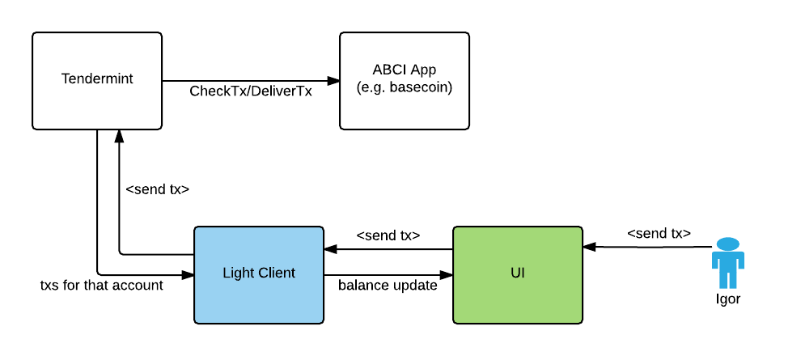

# ADR 2:事件订阅

## 语境

在轻客户端(或任何其他客户端)中，用户可能想要**订阅
使用`/subscribe?event=X` 的交易子集**(而不是全部)。 为了
例如，我想订阅与特定交易相关的所有交易
帐户。 取物也一样。 用户可能希望根据
一些过滤器**(而不是获取所有块)。 例如，我想得到
过去两周内特定账户的所有交易(`tx's block time >= '2017-06-05'`)。

现在你甚至不能在 Tendermint 中订阅“所有交易”。

目标是一个简单易用的 API 来做到这一点。



## 决定

ABCI 应用程序在 `data` 字段内返回带有 `DeliverTx` 响应的标签(_for
现在，稍后我们可能会创建一个单独的字段_)。 标签是一个键值对列表，
protobuf 编码。

示例数据:

```json
{
  "abci.account.name": "Igor",
  "abci.account.address": "0xdeadbeef",
  "tx.gas": 7
}
```

### 订阅交易事件

如果用户只想接收交易的一个子集，ABCI-app 必须
返回带有“DeliverTx”响应的标签列表。 这些标签将被解析并
与当前查询(订阅者)匹配。 如果查询匹配标签，
订阅者将获得交易事件。

```
/subscribe?query="tm.event = Tx AND tx.hash = AB0023433CF0334223212243BDD AND abci.account.invoice.number = 22"
```

必须开发一个新包来替换当前的`events` 包。 它
将允许客户在未来订阅不同类型的事件:

```
/subscribe?query="abci.account.invoice.number = 22"
/subscribe?query="abci.account.invoice.owner CONTAINS Igor"
```

### 获取交易

这有点棘手，因为 a) 我们想要支持许多索引器，所有的
有不同的 API b) 我们不知道标签何时就足够了
对于大多数应用程序(我想我们会看到)。

```
/txs/search?query="tx.hash = AB0023433CF0334223212243BDD AND abci.account.owner CONTAINS Igor"
/txs/search?query="abci.account.owner = Igor"
```

For historic queries we will need a indexing storage (Postgres, SQLite, ...).

### 问题

- https://github.com/tendermint/tendermint/issues/376
- https://github.com/tendermint/tendermint/issues/287
- https://github.com/tendermint/tendermint/issues/525(相关)

## 状态

实施的

## 结果

### 积极的

- 事件通知和搜索 API 的相同格式
- 足够强大的查询

### 消极的

- `match` 函数的性能(我们有太多的查询/订阅者)
- 存在数据库中有太多 txs 的问题

### 中性的
