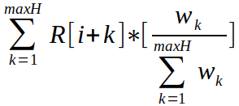
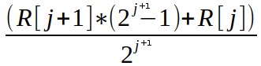

# ADR 006:信任度量设计

## 语境

提议的信任指标将允许 Tendermint 为其直接与之交互的同行维护本地信任排名，然后可用于实施软安全控制.计算来自 [TrustGuard](https://dl.acm.org/citation.cfm?id=1060808) 项目.

### 背景

Tendermint 核心项目开发人员希望通过跟踪对等网络中对等方展示的可信度级别来提高 Tendermint 的安全性和可靠性.这样，来自对等方的不良结果不会立即导致它们从网络中删除(可能导致发生剧烈变化).相反，可以使用适当的指标监控对等点的行为，并在 Tendermint Core 确定对等点构成威胁后将其从网络中删除.例如，当 PEXReactor 向已知对等方请求对等方网络地址，而返回的网络地址不可达时，应跟踪这种不可信行为.返回一些错误的网络地址可能不应该导致对等点被丢弃，而过多的这种行为确实会使对等点被丢弃.

恶意节点可以通过使用策略振荡技术来规避信任指标，该技术会调整恶意节点的行为模式以最大化其目标.例如，如果恶意节点获悉 Tendermint 信任度量的时间间隔为 _X_ 小时，则它可以在恶意活动之间等待 _X_ 小时.我们可以尝试通过增加间隔长度来解决这个问题，但这会降低系统对最近事件的适应性.

相反，具有更短的间隔，但保留间隔值的历史记录，将为我们的指标提供保持网络稳定所需的灵活性，同时还使其能够抵御 Tendermint 对等网络中的战略恶意节点.此外，该指标可以在相当长的时间段内访问信任数据，同时不会通过在大量时间间隔内聚合较旧的历史值来大幅增加其历史记录大小，同时保持最近时间间隔的高精度.这种方法被称为褪色记忆，与人类记住他们的经历的方式非常相似.使用历史数据的权衡是应该在节点的执行之间保留间隔值.

### 参考

S. Mudhakar、L. Xiong 和 L. Liu，“TrustGuard:应对去中心化覆盖网络声誉管理中的漏洞”，_Proceedings of the 14th International Conference on World Wide Web，第 422-431 页，2005 年 5 月.

## 决定

建议的信任度量将允许开发人员将与对等行为相关的所有好坏事件通知信任度量存储，并且可以随时查询该度量以获取对等当前的信任排名.

下面的三个小节将涵盖计算信任等级所考虑的过程、信任度量存储的概念以及信任度量的接口.

### 拟议流程

建议的信任度量将计算与对象相关的好和坏事件，并计算在具有预定义持续时间的间隔内良好计数器的百分比.这是将在信任度量的生命周期中持续的过程.当查询当前**信任值**的信任度量时，将使用弹性方程来执行计算.

所提出的方程类似于控制系统中使用的比例积分微分 (PID) 控制器.比例组件允许我们对最近间隔的值敏感，而积分组件允许我们合并存储在历史数据中的信任值，而导数组件允许我们对一个行为的突然变化给予权重.同行.我们根据当前信任等级、区间 _i_ 之前的信任评级历史(过去 _maxH_ 个区间)及其信任等级波动来计算区间 i 中对等点的信任值.我们将把方程分解为三个部分.

```math
(1) Proportional Value = a * R[i]
```

其中 _R_[*i*] 表示时间间隔 _i_ 的原始信任值(其中 _i_ == 0 是当前时间)，_a_ 是应用于当前报告贡献的权重. 我们等式的下一个组件使用最后 _maxH_ 间隔的加权和来计算时间 _i_ 的历史值:

`H[i] =` 

可以乐观或悲观地选择权重. 乐观权重为较新的历史数据值创建更大的权重，而悲观权重为分数较低的时间间隔创建更大的权重. 历史值计算过程中使用的默认权重是乐观的，计算为 _Wk_ = 0.8^_k_，时间间隔为 _k_. 有了历史值，我们现在可以完成积分值的计算:

```math
(2) Integral Value = b * H[i]
```

其中 _H_[*i*] 表示时间间隔 _i_ 的历史值，_b_ 是应用于被测对象过去性能贡献的权重. 微分分量的计算如下:

```math
D[i] = R[i] – H[i]

(3) Derivative Value = c(D[i]) * D[i]
```

其中 _c_ 的值是根据相对于零的 _D_[*i*] 值选择的. 默认选择过程使 _c_ 等于 0，除非 _D_[*i*] 是负值，在这种情况下 c 等于 1.结果是当当前行为低于以前经历的行为时应用最大惩罚. 如果当前行为比之前经历的行为好，则衍生值对信任值没有影响. 将三个组件放在一起，我们的信任值方程计算如下:

```math
TrustValue[i] = a * R[i] + b * H[i] + c(D[i]) * D[i]
```

作为将保存的原始间隔数据量保持在合理大小 _m_ 的性能优化，同时允许我们表示 2^_m_ - 1 个历史间隔，我们可以使用衰落记忆技术，该技术将交换空间和时间复杂度 通过汇总大量较新的值来提高历史数据值的精度. 虽然我们上面的等式尝试访问最多 _maxH_(可以是 2^_m_ - 1)，但我们将使用下面的等式 4 将这些请求映射到 _m_ 值:

```math
(4) j = index, where index > 0
```

Where _j_ is one of _(0, 1, 2, … , m – 1)_ indices used to access history interval data. Now we can access the raw intervals using the following calculations:

```math
R[0] = raw data for current time interval
```

`R[j] =` 

### 信任指标存储

与 P2P 子系统 AddrBook 类似，信任度量存储将维护与 Tendermint 节点相关的信息.此外，信任度量存储将确保信任度量仅对节点当前直接参与的对等方有效.

Reactor 将向信任度量存储提供对等密钥，以便检索关联的信任度量.信任度量然后可以记录反应器经历的新的正面和负面事件，以及提供由度量计算的当前信任分数.

当节点关闭时，信任度量存储将保存与所有已知对等点关联的信任度量的历史数据.这种保存的信息允许跨节点执行保存与对等方的体验，这可以跨越数天或数周的跟踪窗口.信任历史数据在 OnStart 期间自动加载.

### 界面详细设计

每个信任指标都允许记录正面/负面事件、查询当前信任值/分数以及停止/暂停随时间间隔的跟踪.这可以在下面看到:

```go
// TrustMetric - keeps track of peer reliability
type TrustMetric struct {
    // Private elements.
}

// Pause tells the metric to pause recording data over time intervals.
// All method calls that indicate events will unpause the metric
func (tm *TrustMetric) Pause() {}

// Stop tells the metric to stop recording data over time intervals
func (tm *TrustMetric) Stop() {}

// BadEvents indicates that an undesirable event(s) took place
func (tm *TrustMetric) BadEvents(num int) {}

// GoodEvents indicates that a desirable event(s) took place
func (tm *TrustMetric) GoodEvents(num int) {}

// TrustValue gets the dependable trust value; always between 0 and 1
func (tm *TrustMetric) TrustValue() float64 {}

// TrustScore gets a score based on the trust value always between 0 and 100
func (tm *TrustMetric) TrustScore() int {}

// NewMetric returns a trust metric with the default configuration
func NewMetric() *TrustMetric {}

//------------------------------------------------------------------------------------------------
// For example

tm := NewMetric()

tm.BadEvents(1)
score := tm.TrustScore()

tm.Stop()
```

可以配置一些信任度量参数. 在更多情况下可能应该单独保留权重值，但应考虑跟踪窗口的持续时间和单独的时间间隔.

```go
// TrustMetricConfig - Configures the weight functions and time intervals for the metric
type TrustMetricConfig struct {
    // Determines the percentage given to current behavior
    ProportionalWeight float64

    // Determines the percentage given to prior behavior
    IntegralWeight float64

    // The window of time that the trust metric will track events across.
    // This can be set to cover many days without issue
    TrackingWindow time.Duration

    // Each interval should be short for adapability.
    // Less than 30 seconds is too sensitive,
    // and greater than 5 minutes will make the metric numb
    IntervalLength time.Duration
}

// DefaultConfig returns a config with values that have been tested and produce desirable results
func DefaultConfig() TrustMetricConfig {}

// NewMetricWithConfig returns a trust metric with a custom configuration
func NewMetricWithConfig(tmc TrustMetricConfig) *TrustMetric {}

//------------------------------------------------------------------------------------------------
// For example

config := TrustMetricConfig{
    TrackingWindow: time.Minute * 60 * 24, // one day
    IntervalLength:    time.Minute * 2,
}

tm := NewMetricWithConfig(config)

tm.BadEvents(10)
tm.Pause()
tm.GoodEvents(1) // becomes active again
```

应该使用具有持久存储的数据库创建信任度量存储，以便它可以跨节点执行保存历史数据. 商店实例化的所有信任指标都将使用提供的 TrustMetricConfig 配置创建.

当您尝试获取对等方的信任度量，并且信任度量存储中不存在条目时，将自动创建一个新度量并在存储中创建该条目.

除了获取方法 GetPeerTrustMetric 之外，信任度量标准存储还提供了一种在对等方与节点断开连接时调用的方法. 这样，当节点没有与对等方的直接体验时，指标可以暂停(不会保存历史数据)一段时间.

```go
// TrustMetricStore - Manages all trust metrics for peers
type TrustMetricStore struct {
    cmn.BaseService

    // Private elements
}

// OnStart implements Service
func (tms *TrustMetricStore) OnStart(context.Context) error { return nil }

// OnStop implements Service
func (tms *TrustMetricStore) OnStop() {}

// NewTrustMetricStore returns a store that saves data to the DB
// and uses the config when creating new trust metrics
func NewTrustMetricStore(db dbm.DB, tmc TrustMetricConfig) *TrustMetricStore {}

// Size returns the number of entries in the trust metric store
func (tms *TrustMetricStore) Size() int {}

// GetPeerTrustMetric returns a trust metric by peer key
func (tms *TrustMetricStore) GetPeerTrustMetric(key string) *TrustMetric {}

// PeerDisconnected pauses the trust metric associated with the peer identified by the key
func (tms *TrustMetricStore) PeerDisconnected(key string) {}

//------------------------------------------------------------------------------------------------
// For example

db := dbm.NewDB("trusthistory", "goleveldb", dirPathStr)
tms := NewTrustMetricStore(db, DefaultConfig())

tm := tms.GetPeerTrustMetric(key)
tm.BadEvents(1)

tms.PeerDisconnected(key)
```

## 状态

得到正式认可的.

## 结果

### 积极的

- 信任度量将允许 Tendermint 做出非二进制的安全性和可靠性决策
- 将帮助 Tendermint 实施提供软安全控制的威慑，同时避免网络中断
- 在分析与对等交互相关的一段时间内的性能时，将提供有用的分析信息

### 消极的

- 需要跨节点执行保存信任度量历史数据

### 中性的

- 请记住，好的事件需要像使用此实现的坏事件一样被记录
