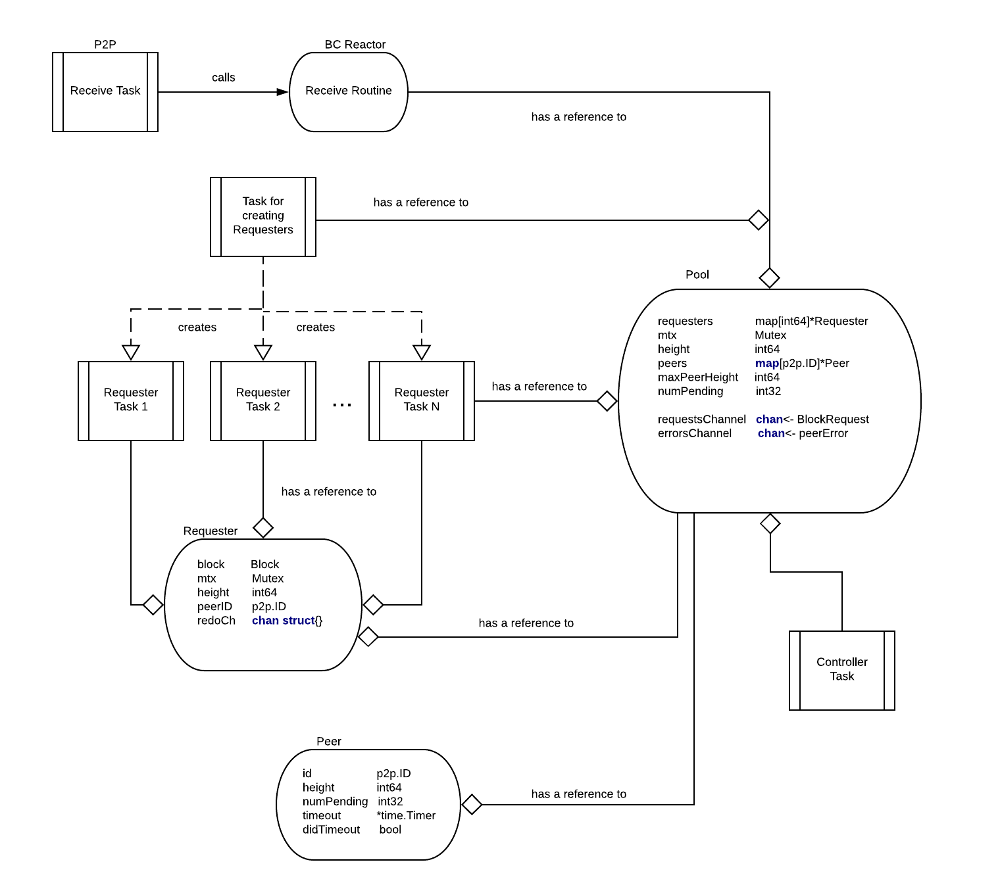
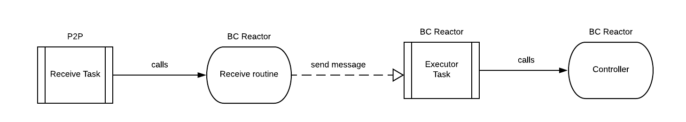

# ADR 040:区块链反应器重构

## 变更日志

19-03-2019:初稿

## 语境

区块链反应器的高级职责是使远远落后于当前状态的对等节点
区块链通过从其对等方并行下载许多块来快速赶上，验证块的正确性，以及
针对 ABCI 应用程序执行它们。我们将区块链反应器执行的协议称为“fast-sync”。
可以在此处找到区块链反应器的当前架构图:



当前的架构由数十个例程组成，并且紧密依赖于`Switch`，使得编写
单元测试几乎不可能。当前的测试需要设置复杂的依赖图并处理并发性。
请注意，在这种情况下，拥有数十个例程是多余的，因为大多数时间例程都处于空闲等待状态
将要发生的事情(消息到达或超时到期)。由于依赖`Switch`，测试相对
复杂的网络场景和故障(例如添加和删除对等点)是非常复杂的任务，并且经常导致
到具有不确定行为的复杂测试 ([#3400])。无法编写适当的测试使人们对
代码低，这导致了几个问题(有些已在此期间修复，有些仍处于打开状态):
[#3400]、[#2897]、[#2896]、[#2699]、[#2888]、[#2457]、[#2622]、[#2026]。

## 决定

为了解决这些问题，我们计划对区块链反应器进行重大重构。提议的架构很大程度上受到启发
由 ADR-30 提供，如下图所示:


我们建议采用一种并发架构，其中核心算法(我们称之为“控制器”)被提取到一个有限的
状态机。反应器的活动例程称为`Executor`，负责接收和发送
来自/到对等方的消息并触发超时。应该发送什么消息和触发超时主要是确定的
由`控制器`。例外是“Peer Heartbeat”机制，它是“Executor”的职责。心跳
机制用于从对等点列表中删除缓慢和无响应的对等点。编写单元测试更简单
这种架构作为大多数关键逻辑是“控制器”功能的一部分。我们期望更简单的并发
架构不会对这个反应堆的性能产生显着的负面影响(有待证实)
实验评价)。


### 实施更改

我们假设“快速同步”协议的系统模型如下:

* 一个节点连接到代表其对等集的所有节点的随机子集。有些节点是正确的，有些节点是正确的
  可能有问题。我们不对故障节点的比率做出假设，即，有可能某些节点中的所有节点
对等设置有问题。
* 我们假设正确节点之间的通信是同步的，即，如果正确的节点 `p` 发送消息 `m` 到
  一个正确的节点“q”在时间“t”，那么“q”将在时间“t+Delta”收到最新的消息，其中“Delta”是一个系统
网络参与者已知的参数。 `Delta` 通常被选择为高于一个数量级
正确节点之间的实际通信延迟(最大)。因此，如果一个正确的节点 `p` 发送了一个请求消息
在时间`t`到一个正确的节点`q`并且在时间`t + 2*Delta`没有相应的回复，那么`p`可以假设
那 `q` 是有问题的。请注意，共识反应器的网络假设是不同的(我们部分假设
同步模型)。

“快速同步”协议的要求正式规定如下:

- `正确性`:如果正确的节点`p`连接到正确的节点`q`足够长的时间，那么`p`
- 最终将从`q`下载所有请求的块。
- `终止`:如果正确节点`p`的一组对等体是稳定的(没有新节点添加到`p`的对等体集中)
- 足够长的时间，然后协议最终终止。
- `Fairness`:正确的节点 `p` 向其对等集合中的所有对等节点发送对块的请求。

如上所述，“Executor”负责发送和接收属于“fast-sync”的消息
协议。以下消息作为“快速同步”协议的一部分进行交换:
``` go
type Message int
const (
  MessageUnknown Message = iota
  MessageStatusRequest
  MessageStatusResponse
  MessageBlockRequest
  MessageBlockResponse
)
```
`MessageStatusRequest` 会定期发送给所有对等方，作为对等方提供其当前高度的请求。 它是
“Peer Heartbeat”机制的一部分以及未能及时响应此消息会导致对等点被删除
来自对等组。 请注意，仅当对等方处于“快速同步”模式时才使用“对等心跳”机制。 我们猜测
这里存在一种机制，使节点有可能通知其对等方它处于“快速同步”模式。

``` go
type MessageStatusRequest struct {
  SeqNum int64     // sequence number of the request
}
```
`MessageStatusResponse` 作为对 `MessageStatusRequest` 的响应发送，以通知请求者当前的对等方
高度。

``` go
type MessageStatusResponse struct {
  SeqNum int64     // sequence number of the corresponding request
  Height int64     // current peer height
}
```

`MessageBlockRequest` 用于在给定高度请求一个块和相应的提交证书。

``` go
type MessageBlockRequest struct {
  Height int64
}
```

`MessageBlockResponse` 是对相应块请求的响应。 除了提供块和
相应的提交证书，它还包含当前的对等高度。

``` go
type MessageBlockResponse struct {
  Height         int64
  Block          Block
  Commit         Commit
  PeerHeight     int64
}
```

除了发送和接收消息，还有`HeartBeat`机制，控制器还管理超时
在“Controller”请求时触发。 一旦超时到期，就会通知“控制器”。

``` go
type TimeoutTrigger int
const (
  TimeoutUnknown TimeoutTrigger = iota
  TimeoutResponseTrigger
  TimeoutTerminationTrigger
)
```

`Controller` 可以建模为具有明确定义输入的函数:

* `State` - 节点的当前状态。 包含有关连接的对等点及其行为、待处理请求、
* 收到的区块等
* `Event` - 网络中的重要事件。

产生清晰的输出:

* `State` - 节点的更新状态，
* `MessageToSend` - 表示要发送什么消息以及发送给哪个对等方
* `TimeoutTrigger` - 表示应该触发超时。


我们考虑以下“事件”类型:

``` go
type Event int
const (
  EventUnknown Event = iota
  EventStatusReport
  EventBlockRequest
  EventBlockResponse
  EventRemovePeer
  EventTimeoutResponse
  EventTimeoutTermination
)
```

`EventStatusResponse` event is generated once `MessageStatusResponse` is received by the `Executor`.

``` go
type EventStatusReport struct {
  PeerID ID
  Height int64
}
```

`EventBlockRequest` event is generated once `MessageBlockRequest` is received by the `Executor`.

``` go
type EventBlockRequest struct {
  Height int64
  PeerID p2p.ID
}
```
`EventBlockResponse` event is generated upon reception of `MessageBlockResponse` message by the `Executor`.

``` go
type EventBlockResponse struct {
  Height             int64
  Block              Block
  Commit             Commit
  PeerID             ID
  PeerHeight         int64
}
```
`EventRemovePeer` is generated by `Executor` to signal that the connection to a peer is closed due to peer misbehavior.

``` go
type EventRemovePeer struct {
  PeerID ID
}
```
`EventTimeoutResponse` is generated by `Executor` to signal that a timeout triggered by `TimeoutResponseTrigger` has
expired.

``` go
type EventTimeoutResponse struct {
  PeerID ID
  Height int64
}
```
`EventTimeoutTermination` is generated by `Executor` to signal that a timeout triggered by `TimeoutTerminationTrigger`
has expired.

``` go
type EventTimeoutTermination struct {
  Height int64
}
```

`MessageToSend` is just a wrapper around `Message` type that contains id of the peer to which message should be sent.

``` go
type MessageToSend struct {
  PeerID  ID
  Message Message
}
```

The Controller state machine can be in two modes: `ModeFastSync` when
a node is trying to catch up with the network by downloading committed blocks,
and `ModeConsensus` in which it executes Tendermint consensus protocol. We
consider that `fast sync` mode terminates once the Controller switch to
`ModeConsensus`.

``` go
type Mode int
const (
  ModeUnknown Mode = iota
  ModeFastSync
  ModeConsensus
)
```
`Controller` is managing the following state:

``` go
type ControllerState struct {
  Height             int64            // the first block that is not committed
  Mode               Mode             // mode of operation
  PeerMap            map[ID]PeerStats // map of peer IDs to peer statistics
  MaxRequestPending  int64            // maximum height of the pending requests
  FailedRequests     []int64          // list of failed block requests
  PendingRequestsNum int              // total number of pending requests
  Store              []BlockInfo      // contains list of downloaded blocks
  Executor           BlockExecutor    // store, verify and executes blocks
}
```

`PeerStats` data structure keeps for every peer its current height and a list of pending requests for blocks.

``` go
type PeerStats struct {
  Height             int64
  PendingRequest     int64             // a request sent to this peer
}
```

`BlockInfo` data structure is used to store information (as part of block store) about downloaded blocks: from what peer
 a block and the corresponding commit certificate are received.
``` go
type BlockInfo struct {
  Block  Block
  Commit Commit
  PeerID ID                // a peer from which we received the corresponding Block and Commit
}
```

The `Controller` is initialized by providing an initial height (`startHeight`) from which it will start downloading
blocks from peers and the current state of the `BlockExecutor`.

``` go
func NewControllerState(startHeight int64, executor BlockExecutor) ControllerState {
  state = ControllerState {}
  state.Height = startHeight
  state.Mode = ModeFastSync
  state.MaxRequestPending = startHeight - 1
  state.PendingRequestsNum = 0
  state.Executor = executor
  initialize state.PeerMap, state.FailedRequests and state.Store to empty data structures
  return state
}
```

The core protocol logic is given with the following function:

``` go
func handleEvent(state ControllerState, event Event) (ControllerState, Message, TimeoutTrigger, Error) {
  msg = nil
  timeout = nil
  error = nil

  switch state.Mode {
  case ModeConsensus:
    switch event := event.(type) {
    case EventBlockRequest:
      msg = createBlockResponseMessage(state, event)
      return state, msg, timeout, error
    default:
      error = "Only respond to BlockRequests while in ModeConsensus!"
      return state, msg, timeout, error
    }

  case ModeFastSync:
    switch event := event.(type) {
    case EventBlockRequest:
      msg = createBlockResponseMessage(state, event)
      return state, msg, timeout, error

    case EventStatusResponse:
      return handleEventStatusResponse(event, state)

    case EventRemovePeer:
      return handleEventRemovePeer(event, state)

    case EventBlockResponse:
      return handleEventBlockResponse(event, state)

    case EventResponseTimeout:
      return handleEventResponseTimeout(event, state)

    case EventTerminationTimeout:
      // Termination timeout is triggered in case of empty peer set and in case there are no pending requests.
      // If this timeout expires and in the meantime no new peers are added or new pending requests are made
      // then `fast-sync` mode terminates by switching to `ModeConsensus`.
      // Note that termination timeout should be higher than the response timeout.
      if state.Height == event.Height && state.PendingRequestsNum == 0 { state.State = ConsensusMode }
      return state, msg, timeout, error

    default:
      error = "Received unknown event type!"
      return state, msg, timeout, error
    }
  }
}
```

``` go
func createBlockResponseMessage(state ControllerState, event BlockRequest) MessageToSend {
  msgToSend = nil
  if _, ok := state.PeerMap[event.PeerID]; !ok { peerStats = PeerStats{-1, -1} }
  if state.Executor.ContainsBlockWithHeight(event.Height) && event.Height > peerStats.Height {
    peerStats = event.Height
    msg = BlockResponseMessage{
     Height:        event.Height,
     Block:         state.Executor.getBlock(eventHeight),
     Commit:        state.Executor.getCommit(eventHeight),
     PeerID:        event.PeerID,
     CurrentHeight: state.Height - 1,
    }
    msgToSend = MessageToSend { event.PeerID, msg }
  }
  state.PeerMap[event.PeerID] = peerStats
  return msgToSend
}
```

``` go
func handleEventStatusResponse(event EventStatusResponse, state ControllerState) (ControllerState, MessageToSend, TimeoutTrigger, Error) {
  if _, ok := state.PeerMap[event.PeerID]; !ok {
    peerStats = PeerStats{ -1, -1 }
  } else {
    peerStats = state.PeerMap[event.PeerID]
  }

  if event.Height > peerStats.Height { peerStats.Height = event.Height }
  // if there are no pending requests for this peer, try to send him a request for block
  if peerStats.PendingRequest == -1 {
    msg = createBlockRequestMessages(state, event.PeerID, peerStats.Height)
    // msg is nil if no request for block can be made to a peer at this point in time
    if msg != nil {
      peerStats.PendingRequests = msg.Height
      state.PendingRequestsNum++
      // when a request for a block is sent to a peer, a response timeout is triggered. If no corresponding block is sent by the peer
      // during response timeout period, then the peer is considered faulty and is removed from the peer set.
      timeout = ResponseTimeoutTrigger{ msg.PeerID, msg.Height, PeerTimeout }
    } else if state.PendingRequestsNum == 0 {
      // if there are no pending requests and no new request can be placed to the peer, termination timeout is triggered.
      // If termination timeout expires and we are still at the same height and there are no pending requests, the "fast-sync"
      // mode is finished and we switch to `ModeConsensus`.
      timeout = TerminationTimeoutTrigger{ state.Height, TerminationTimeout }
    }
  }
  state.PeerMap[event.PeerID] = peerStats
  return state, msg, timeout, error
}
```

``` go
func handleEventRemovePeer(event EventRemovePeer, state ControllerState) (ControllerState, MessageToSend, TimeoutTrigger, Error) {
  if _, ok := state.PeerMap[event.PeerID]; ok {
    pendingRequest = state.PeerMap[event.PeerID].PendingRequest
    // if a peer is removed from the peer set, its pending request is declared failed and added to the `FailedRequests` list
    // so it can be retried.
    if pendingRequest != -1 {
      add(state.FailedRequests, pendingRequest)
    }
    state.PendingRequestsNum--
    delete(state.PeerMap, event.PeerID)
    // if the peer set is empty after removal of this peer then termination timeout is triggered.
    if state.PeerMap.isEmpty() {
      timeout = TerminationTimeoutTrigger{ state.Height, TerminationTimeout }
    }
  } else { error = "Removing unknown peer!" }
  return state, msg, timeout, error
```

``` go
func handleEventBlockResponse(event EventBlockResponse, state ControllerState) (ControllerState, MessageToSend, TimeoutTrigger, Error)
  if state.PeerMap[event.PeerID] {
    peerStats = state.PeerMap[event.PeerID]
    // when expected block arrives from a peer, it is added to the store so it can be verified and if correct executed after.
    if peerStats.PendingRequest == event.Height {
      peerStats.PendingRequest = -1
      state.PendingRequestsNum--
      if event.PeerHeight > peerStats.Height { peerStats.Height = event.PeerHeight }
      state.Store[event.Height] = BlockInfo{ event.Block, event.Commit, event.PeerID }
      // blocks are verified sequentially so adding a block to the store does not mean that it will be immediately verified
      // as some of the previous blocks might be missing.
      state = verifyBlocks(state) // it can lead to event.PeerID being removed from peer list
      if _, ok := state.PeerMap[event.PeerID]; ok {
        // we try to identify new request for a block that can be asked to the peer
        msg = createBlockRequestMessage(state, event.PeerID, peerStats.Height)
        if msg != nil {
          peerStats.PendingRequests = msg.Height
          state.PendingRequestsNum++
          // if request for block is made, response timeout is triggered
          timeout = ResponseTimeoutTrigger{ msg.PeerID, msg.Height, PeerTimeout }
        } else if state.PeerMap.isEmpty() || state.PendingRequestsNum == 0 {
          // if the peer map is empty (the peer can be removed as block verification failed) or there are no pending requests
          // termination timeout is triggered.
           timeout = TerminationTimeoutTrigger{ state.Height, TerminationTimeout }
        }
      }
    } else { error = "Received Block from wrong peer!" }
  } else { error = "Received Block from unknown peer!" }

  state.PeerMap[event.PeerID] = peerStats
  return state, msg, timeout, error
}
```

``` go
func handleEventResponseTimeout(event, state) {
  if _, ok := state.PeerMap[event.PeerID]; ok {
    peerStats = state.PeerMap[event.PeerID]
    // if a response timeout expires and the peer hasn't delivered the block, the peer is removed from the peer list and
    // the request is added to the `FailedRequests` so the block can be downloaded from other peer
  if peerStats.PendingRequest == event.Height {
    add(state.FailedRequests, pendingRequest)
    delete(state.PeerMap, event.PeerID)
    state.PendingRequestsNum--
    // if peer set is empty, then termination timeout is triggered
    if state.PeerMap.isEmpty() {
      timeout = TimeoutTrigger{ state.Height, TerminationTimeout }
    }
  }
  }
  return state, msg, timeout, error
}
```

``` go
func createBlockRequestMessage(state ControllerState, peerID ID, peerHeight int64) MessageToSend {
  msg = nil
  blockHeight = -1
  r = find request in state.FailedRequests such that r <= peerHeight // returns `nil` if there are no such request
  // if there is a height in failed requests that can be downloaded from the peer send request to it
  if r != nil {
    blockNumber = r
    delete(state.FailedRequests, r)
  } else if state.MaxRequestPending < peerHeight {
  // if height of the maximum pending request is smaller than peer height, then ask peer for next block
    state.MaxRequestPending++
    blockHeight = state.MaxRequestPending // increment state.MaxRequestPending and then return the new value
  }

  if blockHeight > -1 { msg = MessageToSend { peerID, MessageBlockRequest { blockHeight } }
  return msg
}
```

``` go
func verifyBlocks(state State) State {
  done = false
  for !done {
    block = state.Store[height]
    if block != nil {
      verified = verify block.Block using block.Commit // return `true` is verification succeed, 'false` otherwise

      if verified {
        block.Execute()   // executing block is costly operation so it might make sense executing asynchronously
        state.Height++
      } else {
        // if block verification failed, then it is added to `FailedRequests` and the peer is removed from the peer set
        add(state.FailedRequests, height)
        state.Store[height] = nil
        if _, ok := state.PeerMap[block.PeerID]; ok {
          pendingRequest = state.PeerMap[block.PeerID].PendingRequest
          // if there is a pending request sent to the peer that is just to be removed from the peer set, add it to `FailedRequests`
          if pendingRequest != -1 {
            add(state.FailedRequests, pendingRequest)
            state.PendingRequestsNum--
          }
          delete(state.PeerMap, event.PeerID)
        }
        done = true
      }
    } else { done = true }
  }
  return state
}
```

在提议的架构中，“Controller”不是活动任务，即它被“Executor”调用。 根据
`Controller`、`Executor` 返回的返回值会发送消息给某个 peer (`msg` != nil)，触发一个
timeout (`timeout` != nil) 或处理错误 (`error` != nil)。
如果超时被触发，它将作为输入提供给`Controller`一次相应的超时事件
超时到期。


## 状态

草稿。

## 结果

### 积极的

- 算法的隔离实现
- 改进的可测试性 - 更容易证明正确性
- 更清晰的关注点分离 - 更容易推理

### 消极的

### 中性的
