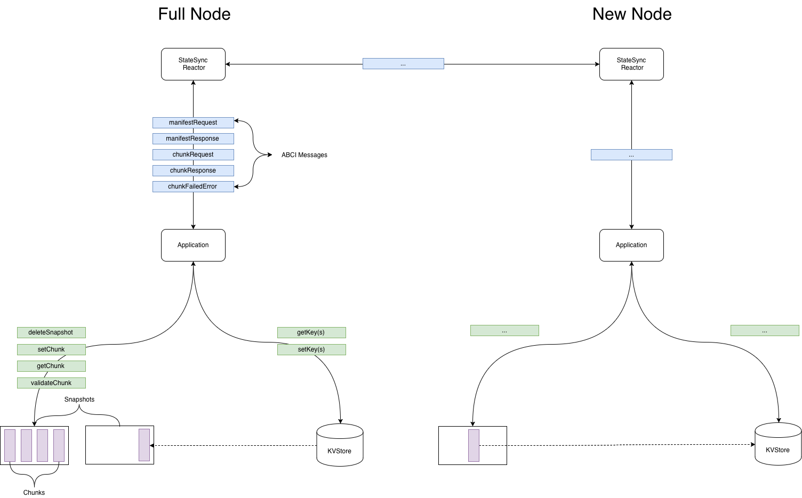

# ADR 042:状态同步设计

## 变更日志

2019-06-27:EB 发起
2019-07-04:brapse 跟进

## 语境
StateSync 是一项允许新节点接收
应用程序状态的快照，无需下载块或去
通过共识。下载后，节点可以切换到 FastSync
并最终参与共识。 StateSync 的目标是
促进尽快设置新节点。

##注意事项
因为 Tendermint 对应用程序状态一无所知，
StateSync 将在节点之间代理消息并通过
ABCI 到一个不透明的应用程序。实现将有多个
Tendermint 代码库和 ABCI 应用程序上的接触点。

* 用于促进对等通信的 StateSync 反应器 - Tendermint
* 一组用于将应用程序状态传输到反应器的 ABCI 消息 - Tendermint
* 一组 MultiStore API，用于将快照数据暴露给 ABCI - ABCI 应用程序
* 具有验证和性能考虑的存储格式 - ABCI 应用程序

### 实现属性
除了方法之外，可以评估 StateSync 的任何实现
跨越不同的标准:

* 速度:生产和消费快照的预期吞吐量
* 安全性:将无效快照推送到节点的成本
* Liveness:阻止节点接收/构建快照的成本
* 努力:一个实现需要多少努力

### 实施问题
* 快照的格式是什么
    * 完整快照
    * 有序的 IAVL 键范围
    * 可以验证的单独压缩的块
* 如何验证数据
    * 盲目地相信对等方的数据
    * 相信大多数同行
    * 使用轻客户端验证来验证每个块是否符合共识
      产生默克尔树根
* 性能特点是什么
    * 随机与顺序读取
    * 调度算法的可并行性如何

### 提案
从广义上讲，有两种方法可以解决这个问题
不同程度的讨论和进展。这些方法可以
总结为:

**懒惰:** 在请求时动态生成快照的地方。这
解决方案将使用现有的数据结构。
**Eager:** 定期生成快照并从磁盘提供服务的地方
请求时间。此解决方案将创建一个辅助数据结构
针对批量读/写进行了优化。

此外，提案往往因如何提供安全而有所不同
特性。
**LightClient** 客户端可以从块中获取默克尔根的地方
从受信任的验证器集同步的标头。应用程序状态的子集，
因此可以在接收时验证被调用的块以确保每个块
是默克尔根的一部分。

**大多数对等节点**块清单和校验和在哪里
下载并与大多数提供的版本进行比较
同行。

#### 懒惰的状态同步
最初的规范由 Alexis Sellier 发布。
在此设计中，状态具有给定的原始元素“大小”(例如
键或节点)，每个元素都被分配了一个从 0 到 `size-1` 的数字，
块由一系列这样的元素组成。阿克拉托斯提出
[一些顾虑](https://docs.google.com/document/d/1npGTAa1qxe8EQZ1wG0a0Sip9t5oX2vYZNUDwr_LVRR4/edit)
关于这个设计，有点特定于 IAVL 树，主要是关于
随机读取和遍历树以确定元素编号的性能
(即元素不是按元素编号索引的)。

Jae Kwon 提出了另一种设计
[#3639](https://github.com/tendermint/tendermint/issues/3639) 分块的地方
惰性且动态地发生:节点从其对等方请求键范围，
和对等点以某些子集响应
请求的范围以及有关如何从其他人并行请求其余部分的说明
同行。与块号不同，可以直接验证密钥。如果某些键在
范围被省略，范围的证明将无法验证。
这样一个节点可以从一个节点请求整个树开始，
并且该对等方可以使用前几个键以及要请求的范围进行响应
来自其他同行。

此外，每个块的验证往往更自然地
懒惰的方法，因为它倾向于使用树的现有结构
(即键或节点)而不是状态同步特定块。这样一个
对于tendermint 的设计最初是在
[#828](https://github.com/tendermint/tendermint/issues/828)。

#### Eager StateSync
在 OpenEthereum 中实现的 Warp Sync 以快速
从对等方下载块和状态快照。数据被雕刻成~4MB
块和活泼的压缩。 snappy 压缩块的散列存储在一个
协调状态同步的清单文件。获取正确的清单
文件似乎需要诚实的大多数同行。这意味着您可能找不到
在您下载整个内容并进行比较之前，状态是不正确的
带有经过验证的区块头。

Binance 实施了类似的解决方案
[#3594](https://github.com/tendermint/tendermint/pull/3594)
基于他们在
[PR #3243](https://github.com/tendermint/tendermint/pull/3243)
和 [一些学习](https://docs.google.com/document/d/1npGTAa1qxe8EQZ1wG0a0Sip9t5oX2vYZNUDwr_LVRR4/edit)。
请注意，这仍然需要诚实的多数对等假设。

作为一种急切协议，warp-sync 可以有效地压缩更大、更多
每个快照一次可预测的块，并为许多新的对等点提供服务。经过
比较懒惰的分块器必须根据请求压缩每个块
时间。

### 懒惰与渴望的分析
Lazy 与 Eager 的共同点多于不同之处。他们都需要
嫩薄荷侧的反应器，一组 ABCI 消息和一种方法
由 SnapshotFormat 促进序列化/反序列化快照。

Lazy 和 Eager 提案的最大区别在于
提供快照块所需的读/写模式。
具体来说，Lazy State Sync 对底层数据执行随机读取
结构，而 Eager 可以优化顺序读取。

Binance 的研究证明了这种方法之间的区别
[ackratos](https://github.com/ackratos) 在他们的 [Lazy
状态同步](https://github.com/tendermint/tendermint/pull/3243)，
[分析](https://docs.google.com/document/d/1npGTAa1qxe8EQZ1wG0a0Sip9t5oX2vYZNUDwr_LVRR4/)
[Warp] 的表现，并跟进实施
同步](http://github.com/tendermint/tendermint/pull/3594)。

#### 比较安全模型
有几种不同的安全模型
过去讨论/提出过，但通常分为两类。

轻客户端验证:其中接收数据的节点预期
首先执行轻客户端同步并拥有所有必要的块
标题。在受信任的区块头内(从信任的角度来看)
验证器设置受[弱
主观性](https://github.com/tendermint/tendermint/pull/3795)) 和
可以将称为块的任何键子集与默克尔根进行比较。
轻客户端验证的优点是区块头是
由验证者签名，这些验证者会因恶意而失去一些东西
行为。如果验证者提供无效的证明，他们可以
削减。

大多数对等验证:包含块列表的清单文件
连同每个块的校验和从一个
可信来源。该来源可以是类似于以下内容的社区资源
[sum.golang.org](https://sum.golang.org) 或者从多数下载
的同龄人。大多数对等安全模型的一个缺点是
使恶意用户期待的攻击黯然失色
使目标节点的对等列表饱和并生成
多数。

第三种选择是将快照相关数据包含在
块头。这可能包括具有相关校验和的清单，并且
通过共识获得保障。这种方法的一个挑战是
确保创建快照不会给块带来撤消负担
通过同步快照创建和块创建来支持。一
最小化负担的方法是针对高度的快照
`H` 包含在块 `H+n` 中，其中 `n` 是一些 `n` 块，
给块propser足够的时间来完成快照
异步。

## 提案:Eager StateSync 与每块轻客户端验证
综合考虑优缺点后得出的结论
急切/懒惰和不同的安全模型是产生状态同步
它急切地生成快照并使用轻客户端验证。这
方法具有预计算高效的性能优势
快照可以使用顺序 IO 按需流式传输到新节点。
其次，通过使用轻客户端验证，我们可以验证每个块
接收并避免大多数基于peer的潜在eclipse攻击
安全。

### 执行
Tendermint 负责下载和验证
来自同行的 AppState。 ABCI应用程序负责采取
来自 TM 的 AppStateChunk 对象并构造一个有效的状态树，其
root 对应同步区块的 AppHash。特别是我们
将需要实施:

* 构建新的 StateSync 反应器代理节点之间的消息传输
  和 ABCI 应用程序
* 一组 ABCI 消息
* 将 SnapshotFormat 设计为一个界面，它可以:
    * 验证块
    * 从文件读/写块
    * 向/从应用程序状态存储读取/写入块
    * 将清单转换为 chunkRequest ABCI 消息
* 为 cosmos-hub 实现 SnapshotFormat，具体实现为:
    * 读/写块的方式可以是:
        * 跨对等并行
        * 收到时验证
    * 读取/写入/从 IAVL+ 树

## 实现路径
* 基于[#3753](https://github.com/tendermint/tendermint/pull/3753)创建StateSync反应器
* 着眼于 cosmos-hub 实现设计 SnapshotFormat
* ABCI 消息发送/接收 SnapshotFormat
* IAVL+ 更改以支持 SnapshotFormat
* 提供 Warp 同步(无块验证)
*弱主观性的轻客户端实现
* 提供带有块验证的 StateSync

## 状态

建议的

## 后果

### 中性的

### 积极的
* 安全和高性能的状态同步设计以现实世界的实施经验为基础
* 通用接口允许特定于应用程序的创新
* 通过合理的工程努力实现可并行化的实施轨迹

### 消极的
* 静态调度缺乏实时块可用性优化的机会

## 参考
[同步​​:同步当前状态，无需完全重播应用程序](https://github.com/tendermint/tendermint/issues/828) - 原始问题
[tendermint 状态同步提案 2](https://docs.google.com/document/d/1npGTAa1qxe8EQZ1wG0a0Sip9t5oX2vYZNUDwr_LVRR4/edit) - ackratos 提案
[提案2实现](https://github.com/tendermint/tendermint/pull/3243) - ackratos实现
[WIP General/Lazy State-Sync 伪规范](https://github.com/tendermint/tendermint/issues/3639) - Jae 提案
[Warp Sync 实现](https://github.com/tendermint/tendermint/pull/3594) - ackratos
[Chunk Proposal](https://github.com/tendermint/tendermint/pull/3799) - Bucky 提议
