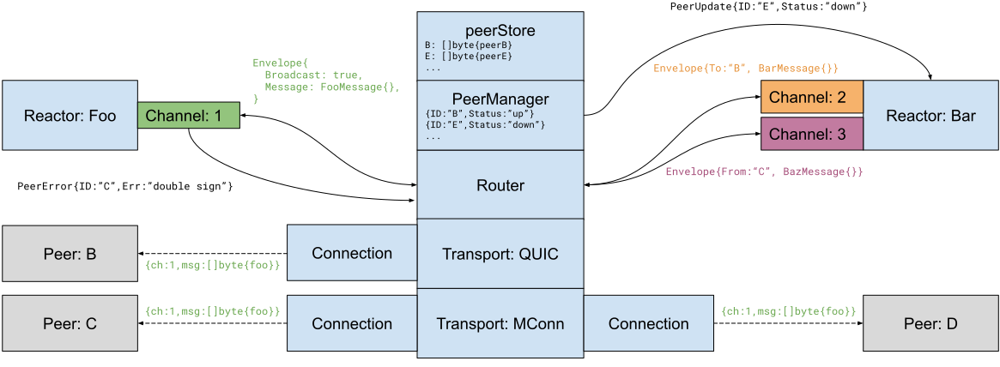

# ADR 062:P2P 架构和抽象

## 变更日志

- 2020-11-09:初始版本 (@erikgrinaker)

- 2020 年 11 月 13 日:删除流 ID，将对等错误移至通道，注意将 PEX 移至核心 (@erikgrinaker)

- 2020-11-16:关于推荐的反应堆实施模式的说明，批准 ADR (@erikgrinaker)

- 2021 年 2 月 4 日:更新了新的 P2P 核心和传输 API 更改 (@erikgrinaker)。

## 语境

在 [ADR 061](adr-061-p2p-refactor-scope.md) 中，我们决定重构点对点 (P2P) 网络堆栈。第一阶段是重新设计和重构内部P2P架构，同时尽可能保留协议兼容性。

## 替代方法

考虑了提议设计的几种变体，包括例如调用接口方法而不是传递消息(如当前架构)，将通道与流合并，将内部对等数据结构暴露给反应器，通过任意编解码器与消息格式无关，等等。选择这种设计是因为它具有非常松散的耦合，更易于推理和更方便使用，避免了内部数据结构的竞争条件和锁争用，使反应器更好地控制消息排序和处理语义，并允许 QoS 调度和以非常自然的方式背压。

[multiaddr](https://github.com/multiformats/multiaddr) 被认为是一种通过常规 URL 与传输无关的对等地址格式，但它似乎没有被广泛采用，并且协议封装和隧道等高级功能可以似乎对我们没有立即有用。

还有一些建议使用 LibP2P 而不是维护我们自己的 P2P 堆栈，这些建议(目前)在 [ADR 061](adr-061-p2p-refactor-scope.md) 中被拒绝。

此 ADR 的初始版本具有面向字节的多流传输 API，但必须放弃/推迟以保持与现有的面向消息的 MConnection 协议的向后兼容性。有关详细信息，请参阅 [tendermint/spec#227](https://github.com/tendermint/spec/pull/227) 中被拒绝的 RFC。

## 决定

P2P 堆栈将被重新设计为面向消息的架构，主要依靠 Go 通道进行通信和调度。它将使用面向消息的传输到具有单个对等点的二进制消息、双向对等可寻址通道来发送和接收 Protobuf 消息、在反应器和对等点之间路由消息的路由器以及管理对等点生命周期信息的对等点管理器。消息传递是 asynchronous with at-most-once delivery.

## 详细设计

该 ADR 主要关注 P2P 堆栈的体系结构和接口，而不是实现细节。因此，此处描述的接口应被视为粗略的架构轮廓，而不是完整的最终设计。

主要设计目标是:

* 组件之间的松散耦合，以获得更简单、更健壮和测试友好的架构。
* 可插拔传输(不一定联网)。
* 更好的消息调度，改进优先级、背压和性能。
* 集中的对等生命周期和连接管理。
* 更好的对等地址检测、广告和交换。
* 与当前 P2P 网络协议的线级向后兼容性，除非它被证明具有太大障碍。

新堆栈中的主要抽象是:

* `Transport`:一种通过 `Connection` 与对等方交换二进制消息的任意机制。
* `Channel`:使用节点 ID 寻址与对等方异步交换 Protobuf 消息的双向通道。
* `Router`:维护与相关对等点的传输连接并路由通道消息。
* `PeerManager`:管理对等生命周期信息，例如决定拨打哪些对等点以及何时拨打，使用“peerStore”进行存储。
* Reactor:一种设计模式，松散地定义为“侦听通道并对消息做出反应的东西”。

这些抽象在下图(代表节点 A 的内部结构)中进行了说明，并在下面进行了详细描述。



### 运输

传输是用于与对等方交换二进制消息的任意机制。例如，gRPC 传输将通过 TCP/IP 连接到对等点并使用 gRPC 协议发送数据，而内存中传输可能使用内部 Go 通道与在另一个 goroutine 中运行的对等点进行通信。请注意，传输本身没有“对等”或“节点”的概念 - 相反，它们在任意端点地址(例如 IP 地址和端口号)之间建立连接，以将它们与 P2P 堆栈的其余部分分离。

运输必须满足以下要求:

* 面向连接，支持监听入站连接和使用端点地址建立出站连接。

* 支持发送具有不同通道 ID 的二进制消息(尽管通道和通道 ID 是在路由器部分解释的更高级别的应用程序协议概念，但它们通过传输层进行线程化以及与现有 MConnection 协议的向后兼容)。

* 通过节点握手交换 MConnection `NodeInfo` 和公钥，并可能对流量进行适当的加密或签名。

初始传输是 Tendermint 当前使用的当前 MConnection 协议的端口，并且应该在线路级别向后兼容。还实现了用于测试的内存中传输。有计划探索可能取代 MConnection 协议的 QUIC 传输。

`Transport`界面如下:

```go
// Transport is a connection-oriented mechanism for exchanging data with a peer.
type Transport interface {
    // Protocols returns the protocols supported by the transport. The Router
    // uses this to pick a transport for an Endpoint.
    Protocols() []Protocol

    // Endpoints returns the local endpoints the transport is listening on, if any.
    // How to listen is transport-dependent, e.g. MConnTransport uses Listen() while
    // MemoryTransport starts listening via MemoryNetwork.CreateTransport().
    Endpoints() []Endpoint

    // Accept waits for the next inbound connection on a listening endpoint, blocking
    // until either a connection is available or the transport is closed. On closure,
    // io.EOF is returned and further Accept calls are futile.
    Accept() (Connection, error)

    // Dial creates an outbound connection to an endpoint.
    Dial(context.Context, Endpoint) (Connection, error)

    // Close stops accepting new connections, but does not close active connections.
    Close() error
}
```

传输如何配置侦听取决于传输，并且不包含在接口中。 这通常发生在传输构建期间，其中创建了一个传输实例并将其设置为在传递给路由器之前侦听适当的网络接口。

#### 端点

`Endpoint` 表示传输端点(例如 IP 地址和端口)。 一个连接总是有两个端点:一个在本地节点，一个在远程节点。 到远程端点的出站连接通过`Dial()` 建立，到侦听端点的入站连接通过`Accept()` 返回。

`Endpoint` 结构是:

```go
// Endpoint represents a transport connection endpoint, either local or remote.
//
// Endpoints are not necessarily networked (see e.g. MemoryTransport) but all
// networked endpoints must use IP as the underlying transport protocol to allow
// e.g. IP address filtering. Either IP or Path (or both) must be set.
type Endpoint struct {
    // Protocol specifies the transport protocol.
    Protocol Protocol

    // IP is an IP address (v4 or v6) to connect to. If set, this defines the
    // endpoint as a networked endpoint.
    IP net.IP

    // Port is a network port (either TCP or UDP). If 0, a default port may be
    // used depending on the protocol.
    Port uint16

    // Path is an optional transport-specific path or identifier.
    Path string
}

// Protocol identifies a transport protocol.
type Protocol string
```

端点是任意的传输特定地址，但如果它们联网，它们必须使用 IP 地址，因此依赖 IP 作为基本的数据包路由协议。这启用了地址发现、广告和交换的策略——例如，私有“192.168.0.0/24”IP 地址应该只被广告给该 IP 网络上的对等点，而公共地址“8.8.8.8”可以被广告给所有同行。类似地，任何给定的端口号都必须代表 TCP 和/或 UDP 端口号，以便使用 [UPnP](https://en.wikipedia.org/wiki/Universal_Plug_and_Play) 进行自动配置，例如NAT 网关。

非联网端点(没有 IP 地址)被认为是本地的，并且只会被通告给通过相同协议连接的其他对等点。例如，用于测试的内存传输使用 `Endpoint{Protocol: "memory", Path: "foo"}` 作为节点 "foo" 的地址，并且这应该只使用`Protocol 通告给其他节点:“记忆”`。

#### 连接

连接代表两个端点(即两个节点)之间建立的传输连接，可用于交换带有逻辑通道 ID(对应于路由器中使用的更高级别的通道 ID)的二进制消息。通过`Transport.Dial()`(出站)或`Transport.Accept()`(入站)建立连接。

建立连接后，必须调用“Transport.Handshake()”来执行节点握手、交换节点信息和公钥以验证节点身份。节点握手不应该真正成为传输层的一部分(这是一个应用程序协议问题)，这是为了与现有的 MConnection 协议向后兼容，将两者混为一谈。 `NodeInfo` 是现有 MConnection 协议的一部分，但似乎没有记录在规范中——有关详细信息，请参阅 Go 代码库。

`Connection`界面如下所示。它省略了当前为与遗留 P2P 堆栈向后兼容而实施的某些添加内容，并计划在最终版本之前删除。

```go
// Connection represents an established connection between two endpoints.
type Connection interface {
    // Handshake executes a node handshake with the remote peer. It must be
    // called once the connection is established, and returns the remote peer's
    // node info and public key. The caller is responsible for validation.
    Handshake(context.Context, NodeInfo, crypto.PrivKey) (NodeInfo, crypto.PubKey, error)

    // ReceiveMessage returns the next message received on the connection,
    // blocking until one is available. Returns io.EOF if closed.
    ReceiveMessage() (ChannelID, []byte, error)

    // SendMessage sends a message on the connection. Returns io.EOF if closed.
    SendMessage(ChannelID, []byte) error

    // LocalEndpoint returns the local endpoint for the connection.
    LocalEndpoint() Endpoint

    // RemoteEndpoint returns the remote endpoint for the connection.
    RemoteEndpoint() Endpoint

    // Close closes the connection.
    Close() error
}
```

这个 ADR 最初提出了一个面向字节的多流连接 API，它遵循更典型的网络 API 约定(使用例如 `io.Reader` 和 `io.Writer` 接口，可以轻松地与其他库组合)。这也将允许将消息帧、节点握手和流量调度的责任转移到公共路由器，而不是跨传输重新实现，并允许更好地使用多流协议，如 QUIC。但是，这需要对被拒绝的 MConnection 协议进行细微的重大更改，有关详细信息，请参阅 [tendermint/spec#227](https://github.com/tendermint/spec/pull/227)。当开始在 QUIC 传输上工作时，应该重新考虑这一点。

### 对等管理

对等点是其他 Tendermint 节点。每个对等点都由唯一的“NodeID”(与节点的私钥相关联)标识。

#### 对等地址

节点有一个或多个“NodeAddress”地址，表示为它们可以到达的 URL。节点地址的示例可能是例如:

* `mconn://nodeid@host.domain.com:25567/path`
*`内存:节点ID`

地址被解析为一个或多个传输端点，例如通过将 DNS 主机名解析为 IP 地址。对等点应始终表示为地址 URL，而不是端点(这是一种较低级别的传输结构)。

```go
// NodeID is a hex-encoded crypto.Address. It must be lowercased
// (for uniqueness) and of length 40.
type NodeID string

// NodeAddress is a node address URL. It differs from a transport Endpoint in
// that it contains the node's ID, and that the address hostname may be resolved
// into multiple IP addresses (and thus multiple endpoints).
//
// If the URL is opaque, i.e. of the form "scheme:opaque", then the opaque part
// is expected to contain a node ID.
type NodeAddress struct {
    NodeID   NodeID
    Protocol Protocol
    Hostname string
    Port     uint16
    Path     string
}

// ParseNodeAddress parses a node address URL into a NodeAddress, normalizing
// and validating it.
func ParseNodeAddress(urlString string) (NodeAddress, error)

// Resolve resolves a NodeAddress into a set of Endpoints, e.g. by expanding
// out a DNS hostname to IP addresses.
func (a NodeAddress) Resolve(ctx context.Context) ([]Endpoint, error)
```

#### 对等经理

P2P 栈需要跟踪很多关于 peer 的内部状态，比如它们的地址、连接状态、优先级、可用性、失败、重试等。这个责任已经被分离到一个`PeerManager`，它跟踪`Router`的这个状态(但不维护实际的传输连接本身，这是路由器的责任)。

`PeerManager` 是一个同步状态机，其中所有状态转换都是序列化的(实现为同步方法调用，持有排他互斥锁)。大多数对等状态有意保持在内部，存储在适当地持久化它的“peerStore”数据库中，并且外部接口传递必要的最少信息量，以避免路由器 goroutine 之间共享状态。这种设计显着简化了模型，与将其放入 P2P 网络核心必须成为的异步并发球相比，它更容易推理和测试。由于预计对等生命周期事件相对较少，因此这也不会对性能产生显着影响。

`Router` 使用 `PeerManager` 请求拨号和驱逐哪些对等点，并报告对等点生命周期事件，例如连接、断开连接和发生的故障。管理器可以通过返回错误来拒绝这些事件(例如拒绝入站连接)。这发生如下:

* 出站连接，通过`Transport.Dial`:
    * `DialNext()`:返回一个对等地址进行拨号，或者阻塞直到一个可用。
    * `DialFailed()`: 报告对端拨号失败。
    * `Dialed()`:报告对等方拨号成功。
    * `Ready()`:报告对等体路由和就绪。
    * `Disconnected()`:报告对端断开连接。

* 入站连接，通过`Transport.Accept`:
    * `Accepted()`:报告入站对等连接。
    * `Ready()`:报告对等体路由和就绪。
    * `Disconnected()`:报告对端断开连接。

* 驱逐，通过`Connection.Close`:
    * `EvictNext()`:返回一个要断开连接的对等体，或者阻塞直到一个可用。
    * `Disconnected()`:报告对端断开连接。

这些调用具有以下接口:

```go
// DialNext returns a peer address to dial, blocking until one is available.
func (m *PeerManager) DialNext(ctx context.Context) (NodeAddress, error)

// DialFailed reports a dial failure for the given address.
func (m *PeerManager) DialFailed(address NodeAddress) error

// Dialed reports a successful outbound connection to the given address.
func (m *PeerManager) Dialed(address NodeAddress) error

// Accepted reports a successful inbound connection from the given node.
func (m *PeerManager) Accepted(peerID NodeID) error

// Ready reports the peer as fully routed and ready for use.
func (m *PeerManager) Ready(peerID NodeID) error

// EvictNext returns a peer ID to disconnect, blocking until one is available.
func (m *PeerManager) EvictNext(ctx context.Context) (NodeID, error)

// Disconnected reports a peer disconnection.
func (m *PeerManager) Disconnected(peerID NodeID) error
```

在内部，“PeerManager”使用数字对等分数来确定对等节点的优先级，例如在决定接下来要拨打哪些对等方时。评分政策尚未实施，但应考虑到例如节点配置，例如“persistent_peers”、正常运行时间和连接故障、性能等。当有更好的节点可用时(例如，当一个持久节点在中断后重新上线时)，管理器还将尝试通过驱逐较低得分的节点来自动升级到更高的节点。

`PeerManager` 还应该有一个 API 来报告来自反应堆的影响其分数的对等行为(例如，签署一个块会增加分数，双重投票会降低分数甚至禁止对等点)，但这还没有被设计和实现。

此外，`PeerManager` 提供了`PeerUpdates` 订阅，每当发生重大对等状态更改时，该订阅将接收`PeerUpdate` 事件。反应器可以使用这些，例如了解对等体何时连接或断开，并采取适当的措施。这是目前相当小的:

```go
// Subscribe subscribes to peer updates. The caller must consume the peer updates
// in a timely fashion and close the subscription when done, to avoid stalling the
// PeerManager as delivery is semi-synchronous, guaranteed, and ordered.
func (m *PeerManager) Subscribe() *PeerUpdates

// PeerUpdate is a peer update event sent via PeerUpdates.
type PeerUpdate struct {
    NodeID NodeID
    Status PeerStatus
}

// PeerStatus is a peer status.
type PeerStatus string

const (
    PeerStatusUp   PeerStatus = "up"   // Connected and ready.
    PeerStatusDown PeerStatus = "down" // Disconnected.
)

// PeerUpdates is a real-time peer update subscription.
type PeerUpdates struct { ... }

// Updates returns a channel for consuming peer updates.
func (pu *PeerUpdates) Updates() <-chan PeerUpdate

// Close closes the peer updates subscription.
func (pu *PeerUpdates) Close()
```

`PeerManager` 还将负责向 PEX 反应器提供对等信息，这些信息可以被其他节点八卦。这需要改进的对等地址检测和广告系统，例如可靠地检测peer和self地址，并且只向同一网络上的其他peer发送私网地址，但是这个系统还没有完全设计和实现。

###频道

虽然低级数据交换通过“传输”发生，但高级 API 基于双向“通道”，可以发送和接收由“NodeID”寻址的 Protobuf 消息。通道由任意的“ChannelID”标识符标识，并且可以交换一种特定类型的 Protobuf 消息(因为必须预定义要解组的类型)。消息传递是异步的并且最多一次。

该通道还可用于报告对等错误，例如当收到无效或恶意的信息时。根据“PeerManager”策略，这可能会导致对等点断开连接或禁止，但可能应该由更广泛的对等点行为 API 替代，该 API 也可以报告良好的行为。

`Channel` 有这个接口:

```go
// ChannelID is an arbitrary channel ID.
type ChannelID uint16

// Channel is a bidirectional channel to exchange Protobuf messages with peers.
type Channel struct {
    ID          ChannelID        // Channel ID.
    In          <-chan Envelope  // Inbound messages (peers to reactors).
    Out         chan<- Envelope  // outbound messages (reactors to peers)
    Error       chan<- PeerError // Peer error reporting.
    messageType proto.Message    // Channel's message type, for e.g. unmarshaling.
}

// Close closes the channel, also closing Out and Error.
func (c *Channel) Close() error

// Envelope specifies the message receiver and sender.
type Envelope struct {
    From      NodeID        // Sender (empty if outbound).
    To        NodeID        // Receiver (empty if inbound).
    Broadcast bool          // Send to all connected peers, ignoring To.
    Message   proto.Message // Message payload.
}

// PeerError is a peer error reported via the Error channel.
type PeerError struct {
    NodeID   NodeID
    Err      error
}
```

通道可以到达任何连接的对等点，并将自动(取消)编组 Protobuf 消息。 消息调度和排队是一个“路由器”实现问题，可以使用任意数量的算法，例如 FIFO、循环、优先级队列等。 由于无法保证消息传递，入站和出站消息都可能被丢弃、缓冲、 根据需要重新排序或阻止。

由于通道只能交换单一类型的消息，因此使用包装器消息类型通常很有用，例如 一个 Protobuf `oneof` 字段，指定它可以包含的一组内部消息类型。 如果外部消息类型实现了 `Wrapper` 接口(参见 [Reactor Example](#reactor-example) 示例)，则通道可以自动执行此(解)包装:

```go
// Wrapper is a Protobuf message that can contain a variety of inner messages.
// If a Channel's message type implements Wrapper, the channel will
// automatically (un)wrap passed messages using the container type, such that
// the channel can transparently support multiple message types.
type Wrapper interface {
    proto.Message

    // Wrap will take a message and wrap it in this one.
    Wrap(proto.Message) error

    // Unwrap will unwrap the inner message contained in this message.
    Unwrap() (proto.Message, error)
}
```

### 路由器

路由器为节点执行 P2P 网络，从“PeerManager”获取指令并将事件报告给“PeerManager”，维护与对等方的传输连接，并在通道和对等方之间路由消息。

实际上，P2P 堆栈中的所有并发都已移至路由器和反应器中，而尽可能多的其他职责已移至单独的组件中，例如可以在很大程度上保持同步的“Transport”和“PeerManager”。 将并发限制在单个核心组件上会更容易推理，因为只有一个并发结构，而其余组件可以串行、简单且易于测试。

`Router` 有一个非常小的 API，因为它主要由 `PeerManager` 和 `Transport` 事件驱动:

```go
// Router maintains peer transport connections and routes messages between
// peers and channels.
type Router struct {
    // Some details have been omitted below.

    logger          log.Logger
    options         RouterOptions
    nodeInfo        NodeInfo
    privKey         crypto.PrivKey
    peerManager     *PeerManager
    transports      []Transport

    peerMtx         sync.RWMutex
    peerQueues      map[NodeID]queue

    channelMtx      sync.RWMutex
    channelQueues   map[ChannelID]queue
}

// OpenChannel opens a new channel for the given message type. The caller must
// close the channel when done, before stopping the Router. messageType is the
// type of message passed through the channel.
func (r *Router) OpenChannel(id ChannelID, messageType proto.Message) (*Channel, error)

// Start starts the router, connecting to peers and routing messages.
func (r *Router) Start() error

// Stop stops the router, disconnecting from all peers and stopping message routing.
func (r *Router) Stop() error
```

所有 Go 通道在 `Router` 中发送并且反应器被阻塞(路由器还选择关闭和关闭信号通道)。 消息调度、优先级划分、背压和减载的责任集中在一个核心的“队列”接口中，该接口用于争用点(即从所有对等点到单个通道，以及从所有通道到单个对等点):

```go
// queue does QoS scheduling for Envelopes, enqueueing and dequeueing according
// to some policy. Queues are used at contention points, i.e.:
// - Receiving inbound messages to a single channel from all peers.
// - Sending outbound messages to a single peer from all channels.
type queue interface {
    // enqueue returns a channel for submitting envelopes.
    enqueue() chan<- Envelope

    // dequeue returns a channel ordered according to some queueing policy.
    dequeue() <-chan Envelope

    // close closes the queue. After this call enqueue() will block, so the
    // caller must select on closed() as well to avoid blocking forever. The
    // enqueue() and dequeue() channels will not be closed.
    close()

    // closed returns a channel that's closed when the scheduler is closed.
    closed() <-chan struct{}
}
```

当前的实现是“fifoQueue”，它是一个简单的无缓冲无损队列，它按照接收到的顺序传递消息并阻塞直到消息被传递(即它是一个 Go 通道)。 路由器将需要更复杂的排队策略，但这尚未实现。

内部`Router` goroutine的结构和设计在`Router` GoDoc中有描述，下面包含以供参考:

```go
// On startup, three main goroutines are spawned to maintain peer connections:
//
//   dialPeers(): in a loop, calls PeerManager.DialNext() to get the next peer
//   address to dial and spawns a goroutine that dials the peer, handshakes
//   with it, and begins to route messages if successful.
//
//   acceptPeers(): in a loop, waits for an inbound connection via
//   Transport.Accept() and spawns a goroutine that handshakes with it and
//   begins to route messages if successful.
//
//   evictPeers(): in a loop, calls PeerManager.EvictNext() to get the next
//   peer to evict, and disconnects it by closing its message queue.
//
// When a peer is connected, an outbound peer message queue is registered in
// peerQueues, and routePeer() is called to spawn off two additional goroutines:
//
//   sendPeer(): waits for an outbound message from the peerQueues queue,
//   marshals it, and passes it to the peer transport which delivers it.
//
//   receivePeer(): waits for an inbound message from the peer transport,
//   unmarshals it, and passes it to the appropriate inbound channel queue
//   in channelQueues.
//
// When a reactor opens a channel via OpenChannel, an inbound channel message
// queue is registered in channelQueues, and a channel goroutine is spawned:
//
//   routeChannel(): waits for an outbound message from the channel, looks
//   up the recipient peer's outbound message queue in peerQueues, and submits
//   the message to it.
//
// All channel sends in the router are blocking. It is the responsibility of the
// queue interface in peerQueues and channelQueues to prioritize and drop
// messages as appropriate during contention to prevent stalls and ensure good
// quality of service.
```

### 反应器示例

虽然反应堆是当前 P2P 堆栈中的一流概念(即有一个明确的 `p2p.Reactor` 接口)，但它们只是新堆栈中的一种设计模式，松散地定义为“在通道上侦听的东西，并且 对消息做出反应”。

由于反应堆很少有正式的约束，它们可以通过多种方式实现。 目前没有推荐的反应堆实施模式，以避免此 ADR 中的过度规范和范围蔓延。 但是，应该在实施过程中尽早完成原型设计和开发反应器模式，以确保使用“Channel”接口构建的反应器能够满足对便利性、确定性测试和可靠性的需求。

下面是一个作为函数实现的简单回声反应器的简单示例。 反应器将交换以下 Protobuf 消息:

```protobuf
message EchoMessage {
    oneof inner {
        PingMessage ping = 1;
        PongMessage pong = 2;
    }
}

message PingMessage {
    string content = 1;
}

message PongMessage {
    string content = 1;
}
```

为 `EchoMessage` 实现 `Wrapper` 接口允许通过通道透明地传递 `PingMessage` 和 `PongMessage`，它会自动(取消)包装在一个 `EchoMessage` 中:

```go
func (m *EchoMessage) Wrap(inner proto.Message) error {
    switch inner := inner.(type) {
    case *PingMessage:
        m.Inner = &EchoMessage_PingMessage{Ping: inner}
    case *PongMessage:
        m.Inner = &EchoMessage_PongMessage{Pong: inner}
    default:
        return fmt.Errorf("unknown message %T", inner)
    }
    return nil
}

func (m *EchoMessage) Unwrap() (proto.Message, error) {
    switch inner := m.Inner.(type) {
    case *EchoMessage_PingMessage:
        return inner.Ping, nil
    case *EchoMessage_PongMessage:
        return inner.Pong, nil
    default:
        return nil, fmt.Errorf("unknown message %T", inner)
    }
}
```

反应器本身将被实现，例如 像这样:

```go
// RunEchoReactor wires up an echo reactor to a router and runs it.
func RunEchoReactor(router *p2p.Router, peerManager *p2p.PeerManager) error {
    channel, err := router.OpenChannel(1, &EchoMessage{})
    if err != nil {
        return err
    }
    defer channel.Close()
    peerUpdates := peerManager.Subscribe()
    defer peerUpdates.Close()

    return EchoReactor(context.Background(), channel, peerUpdates)
}

// EchoReactor provides an echo service, pinging all known peers until the given
// context is canceled.
func EchoReactor(ctx context.Context, channel *p2p.Channel, peerUpdates *p2p.PeerUpdates) error {
    ticker := time.NewTicker(5 * time.Second)
    defer ticker.Stop()

    for {
        select {
        // Send ping message to all known peers every 5 seconds.
        case <-ticker.C:
            channel.Out <- Envelope{
                Broadcast: true,
                Message:   &PingMessage{Content: "👋"},
            }

        // When we receive a message from a peer, either respond to ping, output
        // pong, or report peer error on unknown message type.
        case envelope := <-channel.In:
            switch msg := envelope.Message.(type) {
            case *PingMessage:
                channel.Out <- Envelope{
                    To:      envelope.From,
                    Message: &PongMessage{Content: msg.Content},
                }

            case *PongMessage:
                fmt.Printf("%q replied with %q\n", envelope.From, msg.Content)

            default:
                channel.Error <- PeerError{
                    PeerID: envelope.From,
                    Err:    fmt.Errorf("unexpected message %T", msg),
                }
            }

        // Output info about any peer status changes.
        case peerUpdate := <-peerUpdates:
            fmt.Printf("Peer %q changed status to %q", peerUpdate.PeerID, peerUpdate.Status)

        // Exit when context is canceled.
        case <-ctx.Done():
            return nil
        }
    }
}
```

## 状态

部分实现 ([#5670](https://github.com/tendermint/tendermint/issues/5670))

## 结果

### 积极的

* 减少耦合和简化接口应该会导致更好的可理解性、更高的可靠性和更多的测试。

* 使用通过 Go 通道传递的消息可以更好地控制背压和服务质量调度。

* 对等生命周期和连接管理集中在单个实体中，使其更易于推理。

* 将改进节点地址的检测、通告和交换。

* 额外的传输(例如 QUIC)可以与现有的 MConn 协议并行实现和使用。

* 如果可能的话，P2P 协议不会在初始版本中被破坏。

### 消极的

* 按照预期完全实现新设计可能需要在某个时候对 P2P 协议进行重大更改，尽管最初的实现不应该。

* 逐步迁移现有堆栈并保持向后兼容性将比简单地更换整个堆栈更费力。

* 随着实现的成熟，对 P2P 内部结构的彻底检查可能会导致暂时的性能回归和错误。

* 在“PeerManager”中隐藏对等管理信息可能会阻止某些功能或需要额外的故意接口来进行信息交换，作为简化设计、减少耦合和避免竞争条件和锁争用的权衡。

### 中性的

* 实现细节，例如对等管理、消息调度以及对等和端点广告尚未确定。

## 参考

* [ADR 061:P2P 重构范围](adr-061-p2p-refactor-scope.md)
* [#5670 p2p:内部重构和架构重新设计](https://github.com/tendermint/tendermint/issues/5670)
