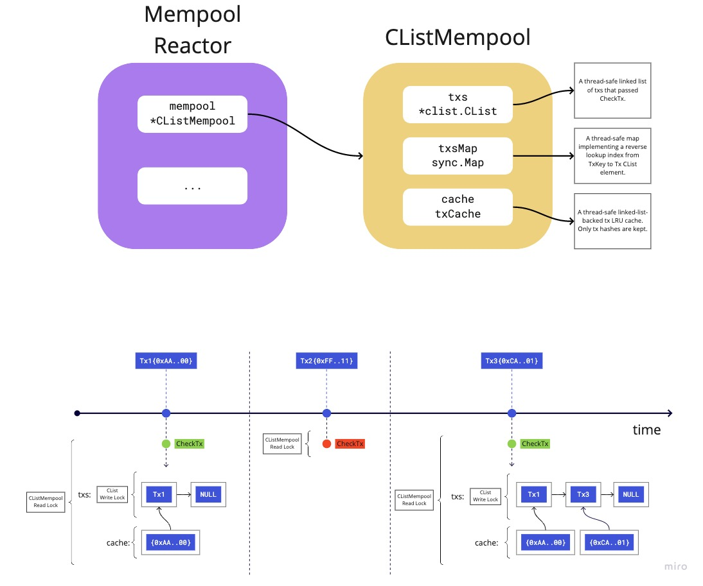

# ADR 067:内存池重构

- [ADR 067:内存池重构](#adr-067-mempool-refactor)
  - [更新日志](#changelog)
  - [状态](#状态)
  - [上下文](#context)
    - [当前设计](#current-design)
  - [替代方法](#alternative-approaches)
  - [现有技术](#prior-art)
    - [以太坊](#ethereum)
    - [Diem](#diem)
  - [决定](#decision)
  - [详细设计](#detailed-design)
    - [CheckTx](#checktx)
    - [内存池](#mempool)
    - [驱逐](#eviction)
    - [八卦](#八卦)
    - [表演](#表演)
  - [未来改进](#future-improvements)
  - [后果](#consequences)
    - [正](#positive)
    - [负](#负)
    - [中性](#中性)
  - [参考文献](#references)

## 变更日志

- 2021 年 4 月 19 日:初稿 (@alexanderbez)

## 状态

公认

## 语境

Tendermint Core 有一个反应器和数据结构 mempool，它有助于
未提交交易的临时存储。参与的诚实节点
Tendermint 网络会互相八卦这些未提交的交易，如果它们
通过应用程序的`CheckTx`。此外，区块提议者从
内存池要包含在下一个块中的未提交事务的子集。

目前，Tendermint Core 中的 mempool 被设计为 FIFO 队列。其他
换句话说，交易在被节点接收时包含在区块中。那里
目前没有对这些未提交的事务进行明确和优先排序。
这给操作员和应用程序带来了一些技术和用户体验方面的挑战。

也就是说，验证者不能通过他们的费用或任何
激励协调机制。此外，缺乏优先级也导致
在 DoS 和网络上的各种攻击向量方面的级联效应，
例如[cosmos/cosmos-sdk#8224](https://github.com/cosmos/cosmos-sdk/discussions/8224)。

因此，Tendermint Core 需要应用程序及其用户能够
以灵活和高效的方式优先处理事务。具体来说，我们是
旨在改进、保持或添加以下属性
Tendermint 内存池:

- 允许应用程序确定的事务优先级。
- 允许高效的并发读取和写入。
- 允许区块提议者通过优先级有效地获得交易。
- 根据交易大小保持固定的内存池容量并驱逐较低优先级
  为更高优先级的交易腾出空间。
- 允许有效地按优先级八卦交易。
- 允许运营商在之前为内存池中的交易指定最大 TTL
  如果没有及时选择区块提案，他们将被自动驱逐。
- 确保设计允许未来的扩展，例如按优先级替换和
  允许每个发件人有多个待处理的交易，很容易合并。

请注意，并非所有这些属性都将通过建议的更改来解决
这个 ADR。但是，该提案将确保任何未解决的财产
可以在未来以简单和可扩展的方式解决。

### 当前设计



`v0` 内存池反应器的核心是一个并发链表。这是
包含已通过“CheckTx”的“Tx”对象的主要数据结构。
当一个节点从另一个节点接收到一个交易时，它会执行“CheckTx”，它
获得对 `*CListMempool` 的读锁。如果交易通过`CheckTx`
在节点本地，通过获取写锁将其添加到 `*CList`。它
也被添加到`cache`和`txsMap`中，两者都获得了各自的
写锁并将交易哈希的引用映射到“Tx”本身。

每当添加新交易时，交易都会不断地传给对等点
到本地节点的“*CList”，其中“*CList”前面的节点被选中。
在 `*CList` 通知读者之前，另一个交易不会被八卦
有更多的交易可以八卦。

当提议者尝试提议一个区块时，他们将执行 `ReapMaxBytesMaxGas`
在反应器的 `*CListMempool` 上。此调用获取对 `*CListMempool` 的读锁
并从 `*CList` 的前面开始选择尽可能多的事务
移动到列表的后面。

当一个块最终被提交时，调用者调用反应器上的“更新”
`*CListMempool` 包含所有选定的交易。注意，调用者还必须
显式地获得对反应器的 `*CListMempool` 的写锁。这个电话
将从 `txsMap` 和 `*CList` 中删除所有提供的交易，两者都是
其中获得各自的写锁。此外，交易
也可以从获取它自己的写锁的“缓存”中删除。

## 替代方法

在考虑采用哪种方法来实现基于优先级的灵活和
高性能内存池，有两个核心候选。第一个候选人较少
在所需的一组协议和实现更改中具有侵入性，其中
简单地扩展现有的`CheckTx` ABCI 方法。第二个候选人本质上
涉及引入新的 ABCI 方法，并且需要更高的学位
协议和实现更改的复杂性，其中一些可能
与即将推出的 [ABCI++](https://github.com/tendermint/spec/blob/master/rfc/004-abci%2B%2B.md)重叠或冲突。

有关各种方法和建议的更多信息，请参阅
[内存池讨论](https://github.com/tendermint/tendermint/discussions/6295)。

## 现有技术

### 以太坊

以太坊内存池，特别是 [Geth](https://github.com/ethereum/go-ethereum)，
包含一个内存池，`*TxPool`，其中包含按帐户索引的各种映射，
例如“待处理”，其中包含帐户的所有可处理交易
由 nonce 优先。它还包含一个“队列”，它是完全相同的映射
除非它包含当前不可处理的交易。内存池也
包含类型为“*txPricedList”的“定价”索引，它是基于优先级队列的
在交易价格上。

### 迪姆

[Diem 内存池](https://github.com/diem/diem/blob/master/mempool/README.md#implementation-details)
包含与我们建议的方法类似的方法。具体来说，Diem 内存池
包含来自 `Account:[]Tx` 的映射。在这个来自帐户的主要映射之上
对于交易列表，是用于执行某些操作的各种索引。

主要索引，`PriorityIndex`。是一个有序的事务队列
“共识就绪”(即，他们有一个序列号，该序列号与
帐户的当前序列号)。这个队列是按gas价格排序的
如果客户愿意为每单位支付更多(比其他客户)
执行，然后他们可以更早地达成共识。

## 决定

为了在 Tendermint Core 中加入基于优先级的灵活且高性能的内存池，
我们将在 `ResponseCheckTx` 中引入新字段 `priority` 和 `sender`
类型。

我们将引入一个新版本的内存池反应器，`v1` 并假设一个隐式
当前内存池反应器的版本为“v0”。在新的“v1”内存池反应器中，
我们在很大程度上保持与 `v0` 相同的功能，除了我们增加了底层
数据结构。具体来说，我们保持发送者到交易对象的映射。
在此映射之上，我们对交易进行索引以提供有效地
八卦和优先获得交易。

## 详细设计

### CheckTx

我们在 `ResponseCheckTx` 类型中引入了以下新字段:

```diff
message ResponseCheckTx {
  uint32         code       = 1;
  bytes          data       = 2;
  string         log        = 3;  // nondeterministic
  string         info       = 4;  // nondeterministic
  int64          gas_wanted = 5 [json_name = "gas_wanted"];
  int64          gas_used   = 6 [json_name = "gas_used"];
  repeated Event events     = 7 [(gogoproto.nullable) = false, (gogoproto.jsontag) = "events,omitempty"];
  string         codespace  = 8;
+ int64          priority   = 9;
+ string         sender     = 10;
}
```


完全取决于应用程序来确定如何填充这些字段
以及什么值，例如`sender` 可以是签名者和费用支付者
在交易中，“优先级”可以是费用的累计金额。

只有`sender`是必需的，而`priority`可以省略，这会导致
使用默认值零。

### 内存池

现有的并发安全链表将被线程安全映射替换
`<sender:*Tx>`，即从 `sender` 到单个 `*Tx` 对象的映射，其中
每个 `*Tx` 是来自给定 `sender` 的下一个有效且可处理的交易。

在此映射之上，我们使用线程安全的方式按优先级索引所有事务
优先级队列，即 [最大堆](https://en.wikipedia.org/wiki/Min-max_heap)。
当提议者准备好为下一个区块提议选择交易时，
按照最高优先级顺序从该优先级索引中选择事务。
当一个事务被选中并被收割时，它就会从这个索引中移除，并且
来自 `<sender:*Tx>` 映射。

我们将 `Tx` 定义为以下数据结构:

```go
type Tx struct {
  // Tx represents the raw binary transaction data.
  Tx []byte

  // Priority defines the transaction's priority as specified by the application
  // in the ResponseCheckTx response.
  Priority int64

  // Sender defines the transaction's sender as specified by the application in
  // the ResponseCheckTx response.
  Sender string

  // Index defines the current index in the priority queue index. Note, if
  // multiple Tx indexes are needed, this field will be removed and each Tx
  // index will have its own wrapped Tx type.
  Index int
}
```

### 驱逐

在为新的“Tx”成功执行“CheckTx”并且内存池当前处于
已满，我们必须检查是否存在可以驱逐的较低优先级的“Tx”
为具有更高优先级和足够大小的新“Tx”腾出空间
剩余容量。

如果存在这样的`Tx`，我们通过获取读锁和排序来找到它
优先队列索引。排序后，我们会找到优先级较低的第一个“Tx”，然后
大小以使新的“Tx”适合内存池的大小限制。然后我们
从优先级队列索引中移除这个 `Tx` 以及 `<sender:*Tx>`
映射。

这将需要额外的“O(n)”空间和“O(n*log(n))”运行时复杂度。请注意，空间复杂度不取决于 tx 的大小。

### 八卦

我们保留现有的线程安全链表作为附加索引。使用这个
索引，我们可以以与它们相同的方式有效地八卦交易
现在八卦(FIFO)。

八卦交易不需要锁定任何其他索引。

### 表现

除了空间开销外，性能应该在很大程度上不受影响
保留一个额外的优先级队列索引以及我们需要驱逐的情况
来自优先队列索引的事务。不应该有读取
块写入任何索引

## 未来的改进

有一些重要的方法可以改进或改进提议的设计
扩展了。即，交易八卦和支持的能力
来自同一个“发件人”的多笔交易。

关于交易八卦，我们需要凭经验验证我们是否
需要优先八卦。另外，目前的八卦方法可能不
成为最有效率的。具体来说，广播一个节点的所有交易
它的内存池中有它的同行。相反，我们应该探索能力
基于请求/响应的八卦交易类似于以太坊和其他
协议。这不仅降低了带宽和复杂性，而且还允许
以便我们更有效地按优先级或其他维度探索八卦。

允许来自同一个“发件人”的多个交易很重要并且将
很可能是未来内存池开发中需要的功能，但对于
现在只要同意初步设计就足够了。有能力
支持每个“发件人”的多个交易需要仔细考虑
关于相应 ABCI 应用程序的相互作用。无论如何，该
提议的设计应允许进行调整以支持此功能
无争议和向后兼容的方式。

## 结果

### 积极的

- 允许应用程序优先处理事务。

### 消极的

- 增加了 `ResponseCheckTx` 协议缓冲区类型的大小。
- 不维护因果顺序。
  - 以特定顺序广播的某些交易可能会
  通过`CheckTx`但最终没有在块中提交，因为它们失败了
  稍后`CheckTx`。例如考虑从现有的发送资金的 Tx<sub>1</sub>
  帐户 Alice 到一个优先级为 P<sub>1</sub> 的 _new_ 帐户 Bob，然后稍后
  Bob 的 _new_ 帐户在 Tx<sub>2</sub> 和 P<sub>2</sub> 中将资金发送回 Alice，
  使得 P<sub>2</sub> > P<sub>1</sub>。如果按此顺序执行，则两者
  交易将通过`CheckTx`。但是，当提议者准备好选择时
  下一个区块提案的交易，他们将在之前选择 Tx<sub>2</sub>
  Tx<sub>1</sub> 和 Tx<sub>2</sub> 将 _fail_ 因为 Tx<sub>1</sub> 必须
  首先被执行。这是因为有一个_因果顺序_，
  Tx<sub>1</sub> ➝ Tx<sub>2</sub>。这些类型的情况应该很少见，因为
  大多数交易都没有因果关系，可以简单地规避
  在稍后的时间点重试或确保“子”优先级为
  低于“父”优先级。换句话说，如果父母总是有
  比他们的孩子更高的优先权，那么新的内存池设计将
  保持因果顺序。

### 中性的

- 通过`CheckTx`并进入内存池的交易稍后可以被驱逐
  在未来的某个时间点，如果在
  内存池已满。

## 参考

- [ABCI++](https://github.com/tendermint/spec/blob/master/rfc/004-abci%2B%2B.md)
- [内存池讨论](https://github.com/tendermint/tendermint/discussions/6295)
