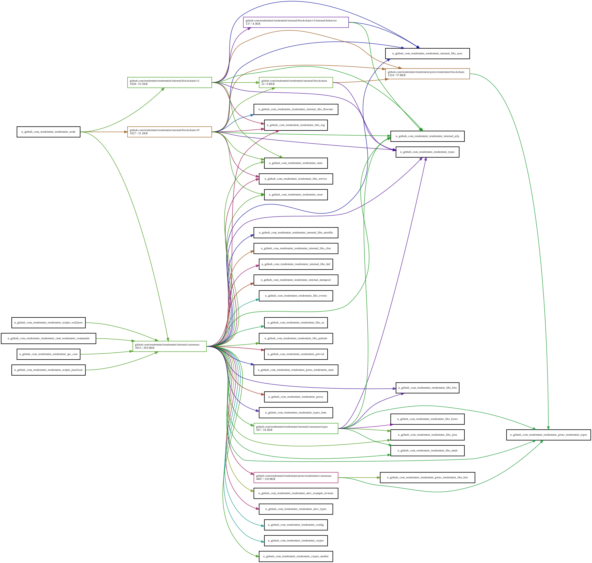

# ADR 069:灵活的节点初始化

## 长日志

- 2021-06-09:初稿(@tychoish)

- 2021-07-21:重大修订(@tychoish)

## 状态

建议的.

## 语境

为了支持 [Go-API-Stability](./adr-060-go-api-stability.md)，
在 0.35 开发周期中，我们尝试减少 API
通过将 `node` 包的大部分界面移动到
未导出的函数，以及将反应器移至“内部”
包裹.与 0.35 版本重合非常有意义
因为这些接口_已经_由于`p2p`而改变了
[refactor](./adr-061-p2p-refactor-scope.md)，所以思考一下是有道理的
更多关于tendermint如何公开这个API.

而P2P层的接口和大部分节点包已经
内化，这排除了一些对
使用tendermint作为库的用户.具体来说，反省
最新版本不支持tendermint节点服务和更换组件
版本的代码，其中一些用例需要维护一个
代码的供应商副本.添加这些功能需要相当广泛的
(内部/实现)对`node` 和`rpc` 包的更改，以及这个
ADR 描述了一种用于改变tendermint 节点初始化方式的模型，在
提供这种功能的服务.

我们考虑节点初始化，因为当前的实现
提供所有组件之间的强连接，以及
节点和RPC层的组件，能够思考
关于这些组件的交互将有助于实现这些
功能并帮助定义节点包的要求.

## 替代方法

提出这些替代方案以构建设计空间并
将决策与产品要求相关联.这些
想法本质上并不坏，甚至可能是可能的或可取的
在(遥远的)未来，仅提供额外的背景说明
我们，在那一刻做出了我们的决定.

### 没做什么

当前的实现是功能性的，足以满足广大
大多数用例(例如，Cosmos-SDK 的所有用户以及
单独运行tendermint和ABCI应用程序的任何人
过程).在当前的实现中，甚至以前的版本中，
需要修改节点初始化或注入自定义组件
复制大部分`node`包，这需要这样的用户
维护tendermint的销售副本.

虽然这(可能)从长远来看是站不住脚的，但正如用户所希望的
更多的模块化，当前的服务实现是脆弱的
难以维持，短期内可能会延迟
执行有点.然而，最终，我们将需要使
`node` 包更易于维护和推理.

### 通用服务可插拔性

一种可能的系统设计是导出接口(在 Golang
sense) 用于系统的所有组件，以允许运行时依赖
注入系统中的所有组件，让用户可以编写
任意用户提供的组件的tendermint节点.

虽然这种级别的定制会带来好处，但它会是一个巨大的
我们没有的承诺(特别是关于 API 设计工作)
目前的范围.最终为某些类型提供支持
可插拔性可能很有用，因此当前的解决方案并未明确
排除这种选择的可能性.

### 基于抽象依赖的启动和关闭

本文档中的主要提议使tendermint节点初始化更简单
更抽象，但系统缺乏一些
守护进程/服务初始化可以提供的功能，例如
系统允许服务的作者控制初始化和关闭顺序
使用依赖关系的组件.

这样的系统可以通过允许服务声明来工作
对其他反应器的初始化顺序依赖性(可能通过 ID)
以便节点可以根据
服务声明的依赖关系，而不是要求节点
直接编码这个逻辑.

这个级别的配置可能比需要的更复杂.给定的
当前实施的tendermint中组件的作者
已经*做*需要了解其他组件，一个基于依赖的系统
在这个阶段可能会过于抽象.

## 决定

- 最大程度地考虑代码库，以便
  包负责自己的初始化，并最小化
  `node` 包本身的代码量.

- 作为设计目标，减少之间的直接耦合和依赖
  `node` 实现中的组件.

- 开始迭代更灵活的内部框架
  初始化tendermint节点以进行初始化过程
  通过节点对象的实现减少硬编码.

  - 反应器不需要在*内*暴露它们的接口
节点类型的实现

  - 这种重构应该对用户完全不透明.

  - 这些节点初始化更改应该不需要
重新评估“service.Service”或通用初始化
编排框架.

- 不要主动提供注射系统
  组件/服务
  如果将来可以改进这种可插拔性
  需要.

- 优先实现基于 p2p 的状态同步反应器以避免
  需要用户注入自定义状态同步提供程序.

## 详细设计

[当前
nodeImpl](https://github.com/tendermint/tendermint/blob/master/node/node.go#L47)
包括对每个实现的直接引用
反应器，应替换为对“service.Service”的引用
对象.这将需要移动构建 [rpc
服务](https://github.com/tendermint/tendermint/blob/master/node/node.go#L771)
进入构造函数
[makeNode](https://github.com/tendermint/tendermint/blob/master/node/node.go#L126).一
可能的实现是消除当前的
节点包上的`ConfigureRPC`方法，而是[配置它
这里](https://github.com/tendermint/tendermint/pull/6798/files#diff-375d57e386f20eaa5f09f02bb9d28bfc48ac3dca18d0325f59492208219e5618R441).

为了避免增加`node`包的复杂性，我们将添加一个
`service` 包的复合服务实现
实现了`service.Service`并由一系列
底层`service.Service` 对象并处理它们
按指定的顺序启动/关闭.

共识、块同步(*née* 快速同步)和状态同步都依赖于
彼此之间，并且具有显着的初始化依赖项
目前在`node`包中编码.作为这一变化的一部分，一个
新包/组件(可能名为“blocks”，位于
`internal/blocks`) 将封装这些块的初始化
代码的管理领域.

### 可注射组件选项

本节简要描述了一个可能的实现
在节点内运行的用户提供的服务.这不应该
除非用户提供的组件是一个硬性要求
一个用户.

为了允许更换组件，一个新的公共功能
将被添加到 `node` 的公共接口中，并带有一个签名
类似于以下内容:

```go
func NewWithServices(conf *config.Config,
	logger log.Logger,
	cf proxy.ClientCreator,
	gen *types.GenesisDoc,
	srvs []service.Service,
) (service.Service, error) {
```

`service.Service` 对象将按照提供的顺序初始化，之后
所有预配置/默认服务都已启动(并反向关闭)
命令).给定的服务可以实现额外的接口，允许它们
替换特定的默认服务. `NewWithServices` 将验证输入
具有以下规则的服务列表:

- 可能没有任何服务正在运行.
- 调用者不能为一个给定的反应堆提供一个以上的替代反应堆
  默认服务类型.

如果调用者违反任何这些规则，`NewWithServices` 将返回
一个错误.为了将来撤回对此类操作的支持，
该函数可以修改为*总是*返回错误.

## 结果

### 积极的

- 节点包将变得更容易维护.

- 在tendermint中添加附加服务将变得更加容易
  节点.

- 可以替换节点中的默认组件
  包而不出售tendermint repo和修改内部
  代码.

- 当前的端到端 (e2e) 测试套件将能够防止任何
  回归，并且可以对新功能进行彻底的单元测试.

- 这个项目的范围很窄，可以将风险降到最低.

### 消极的

- 这增加了我们对`service.Service` 接口的依赖，它
  可能不是我们想要完全承诺的接口.

- 该提案实现了相当少的功能集，并且
  为许多附加功能留下了可能性
  不包括在本提案的范围内.

### 中性的

不适用

## 开放问题

- 这个新的初始化框架需要在多大程度上适应
  传统的 p2p 堆栈？是否有可能延迟很多
  工作到 0.36 周期以避免这种复杂性？

  - 答案:_取决于时间_，以及在 0.35 中运送可插拔反应堆的要求.

- 应该在哪里为 0.35 导出额外的公共类型
  发布？

  与我们要弃用的 API 稳定化通用项目相关
  `types` 包，并将其内容移动到新的 `pkg` 层次结构中；
  然而，`pkg` 接口的设计目前没有详细说明.
  如果在 0.35 版本中要保留 `types`，那么我们应该考虑
  在一个代码中使用多种组织方式的影响
  单发行.

## 未来的工作

- 改进或简化`service.Service` 接口.有一些
  这个接口的限制非常明显(没有
  超时的方式慢启动或关闭，之间的循环
  `service.BaseService` 和 `service.Service` 实现是
  令人不安，`OnReset` 中的默认恐慌似乎令人不安.)

- 作为`service.Service`重构的一部分，拥有所有服务/节点
  尊重 `context.Context` 对象的生命周期，并避免
  在 p2p 中创建 `context.Context` 对象的当前做法和
  反应堆代码.这是进程内多租户所必需的.

- 支持组件之间的显式依赖关系并允许
  并行启动，使不同的反应器可以同时启动
  时间，在可能的情况下.

## 参考

- [这
  分支](https://github.com/tendermint/tendermint/tree/tychoish/scratch-node-minimize)
  包含实现节点包的实验工作
  解除组件之间的一些硬依赖关系.

- [组件
  图](https://peter.bourgon.org/go-for-industrial-programming/#the-component-graph)
  作为内部服务建设的框架.

## 附录

### 依赖

区块链和共识反应器之间有关系
由以下依赖关系图描述使得替换一些
这些组件相对于其他反应器更难或
组件.


