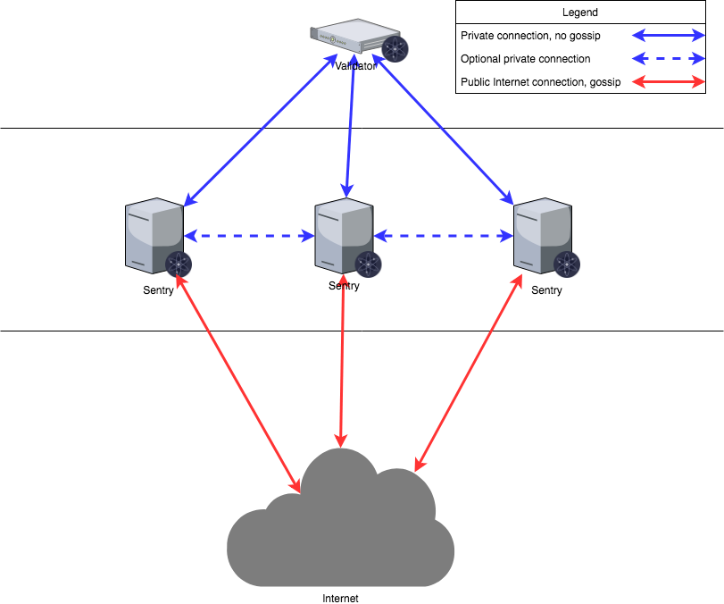

# 验证器

验证者负责在区块链中提交新区块.
这些验证者通过广播参与共识协议
_votes_ 包含每个人签名的加密签名
验证者的私钥.

一些 PoS 共识算法旨在创建一个“完全”
分散的系统，所有利益相关者(甚至那些不是
始终在线可用)参与块的提交.
Tendermint 有一种不同的方法来创建块.验证器是
预计在线，并且验证器集已获得许可/策划
通过一些外部过程.不需要股权证明，但可以
在 Tendermint 共识之上实施.也就是说，验证器可能是
需要在链上、链下或可能不需要发布抵押品
发布任何抵押品.

验证器有一个加密密钥对和相关数量的
“投票权”.投票权不必相同.

## 成为验证者

有两种方法可以成为验证者.

1.它们可以在[创世状态](../tendermint-core/using-tendermint.md#genesis)中预先建立
2. ABCI 应用程序响应 EndBlock 消息，更改
   现有的验证器集.

## 设置验证器

在设置验证器时，有无数种方法可以配置您的设置.本指南旨在展示其中之一，哨兵节点设计.这种设计主要是为了防止DDOS.

### 网络布局

该图基于 AWS，其他云提供商也会有类似的解决方案来设计解决方案.运行节点不仅限于云提供商，您也可以在裸机系统上运行节点.无论您决定采用哪种设置，架构都是相同的.

提议的网络图类似于企业环境中经典的后端/前端服务分离.在这种情况下，“后端”是数据中心验证者的专用网络.数据中心网络可能涉及多个子网、防火墙和冗余设备，本图中未详细说明.重要的一点是数据中心允许直接连接到所选的云环境. Amazon AWS 有“Direct Connect”，而 Google Cloud 有“Partner Interconnect”.这是到云提供商的专用连接(通常直接连接到您在其中一个区域中的虚拟私有云实例).

所有哨兵节点(“前端”)都使用此私有连接连接到验证器.验证器没有公共 IP 地址来提供其服务.

亚马逊在一个区域内有多个可用区.也可以在其他地区安装哨兵节点.在这种情况下，第二个、第三个和更多区域需要与验证器节点建立私有连接.这可以通过 VPC 对等互连(Google Cloud 中的“VPC 网络对等互连”)来实现.在这种情况下，第二个、第三个和更多的区域哨兵节点将被引导到第一个区域，并通过直接连接到数据中心，到达验证器.

一个更持久的解决方案(图中未详细说明)是从数据中心与不同区域建立多个直接连接.这种方式 VPC 对等连接不是强制性的，尽管仍然有利于哨兵节点.这克服了依赖于一个区域的风险.它更昂贵.

### 本地配置

验证器只会与提供的哨兵通信，哨兵节点将通过秘密连接与验证器通信，通过正常连接与网络的其余部分通信.哨兵节点也可以选择相互通信.

初始化节点时，`config.toml` 中有五个可能需要更改的参数.

- `mode:`(完整 | 验证器 | 种子)节点模式(默认:'完整').如果要将节点作为验证器运行，请将其更改为“验证器”.
- `pex:` 布尔值.这将为节点打开或关闭对等交换反应器.当`pex=false` 时，只有`persistent-peers` 列表可用于连接.
- `persistent-peers:` 逗号分隔的 `nodeID@ip:port` 值列表，用于定义预期始终在线的对等点列表.这在第一次启动时是必要的，因为通过设置 `pex=false` 节点将无法加入网络.
- `unconditional-peer-ids:` 逗号分隔的 nodeID 列表.无论入站和出站对等点的限制如何，这些节点都将被连接.当哨兵节点拥有完整的地址簿时，这很有用.
- `private-peer-ids:` 逗号分隔的 nodeID 列表.这些节点不会被传到网络上.这是一个重要的领域，因为您不希望您的验证器 IP 被传到网络上.
- `addr-book-strict:` 布尔值.默认情况下，将考虑连接具有可路由地址的节点.如果此设置关闭 (false)，则不可路由的 IP 地址(如专用网络中的地址)可以添加到地址簿中.
- `double-sign-check-height` int64 高度.在加入共识之前要回溯多少个区块以检查节点的共识投票是否存在 当非零时，如果使用相同的共识密钥来签署 {double_sign_check_height} 最后一个区块，则节点将在重新启动时发生恐慌.因此，验证者应该停止状态机，等待一些区块，然后重新启动状态机以避免恐慌.

#### 验证器节点配置

| Config Option            | Setting                    |
| ------------------------ | -------------------------- |
| mode                     | validator                  |
| pex                      | false                      |
| persistent-peers         | list of sentry nodes       |
| private-peer-ids         | none                       |
| unconditional-peer-ids   | optionally sentry node IDs |
| addr-book-strict         | false                      |
| double-sign-check-height | 10                         |

要将节点作为验证器运行，请确保“mode=validator”. 验证器节点应该有`pex=false`，这样它就不会传到整个网络. 持久节点将是您的哨兵节点. 私有节点可以留空，因为验证器不会试图隐藏与谁通信. 设置无条件节点对于验证器是可选的，因为它们没有完整的地址簿.

#### 哨兵节点配置

| Config Option          | Setting                                       |
| ---------------------- | --------------------------------------------- |
| mode                   | full                                          |
| pex                    | true                                          |
| persistent-peers       | validator node, optionally other sentry nodes |
| private-peer-ids       | validator node ID                             |
| unconditional-peer-ids | validator node ID, optionally sentry node IDs |
| addr-book-strict       | false                                         |

哨兵节点应该能够与整个网络对话，因此为什么`pex=true`.哨兵节点的持久对等节点将是验证者，也可以是其他哨兵节点.哨兵节点应该确保他们不会八卦验证者的 ip，要做到这一点，您必须将验证者节点 ID 作为私有节点.无条件对等 ID 将是验证器 ID 和可选的其他哨兵节点.

> 注意:设置节点的防火墙时不要忘记保护它们.

可以在以下链接中找到更多信息:

- <https://kb.certus.one/>
- <https://forum.cosmos.network/t/sentry-node-architecture-overview/454>

### 验证键

在设计设置时，保护验证者的共识密钥是最重要的因素.验证者在创建节点时提供的密钥称为共识密钥，它必须始终在线才能对块进行投票. **不建议**仅将您的私钥保存在默认的 json 文件(`priv_validator_key.json`)中.幸运的是，[Interchain Foundation](https://interchain.io/) 已经与一个团队合作，为验证者构建了一个密钥管理服务器.您可以在 [此处](https://github.com/iqlusioninc/tmkms) 中找到有关如何使用它的文档，它在生产中被广泛使用.你不限于使用这个工具，还有[HSMs](https://safenet.gemalto.com/data-encryption/hardware-security-modules-hsms/)，没有推荐的HSM.

目前，Tendermint 使用 [Ed25519](https://ed25519.cr.yp.to/) 密钥，这些密钥在安全部门和 HSM 中得到广泛支持.

## 提交一个块

> **+2/3 是“超过 2/3”的缩写**

当验证者设置符号的+2/3 [precommit
投票](https://github.com/tendermint/spec/blob/953523c3cb99fdb8c8f7a2d21e3a99094279e9de/spec/blockchain/blockchain.md#vote)在同一“回合”中为该区块投票.
+2/3 组预提交投票称为
[_commit_](https://github.com/tendermint/spec/blob/953523c3cb99fdb8c8f7a2d21e3a99094279e9de/spec/blockchain/blockchain.md#commit).而任何 +2/3 套
相同高度和轮次的相同块的预提交可以作为
验证，规范提交包含在下一个块中(请参阅
[LastCommit](https://github.com/tendermint/spec/blob/953523c3cb99fdb8c8f7a2d21e3a99094279e9de/spec/blockchain/blockchain.md#lastcommit)).
