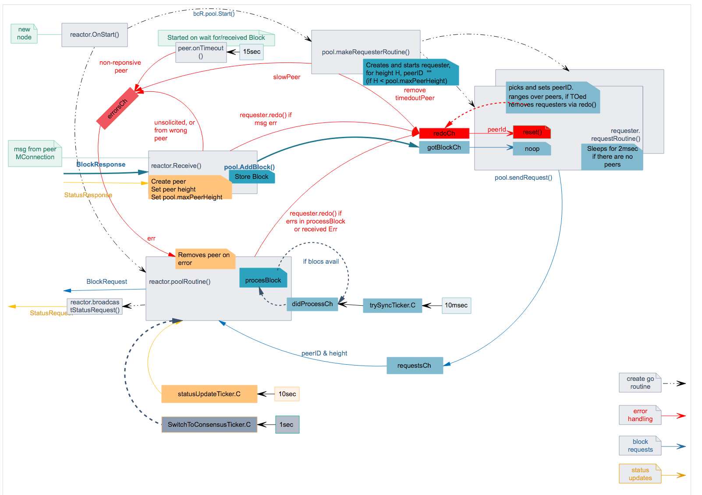

# 执行

## 块同步反应器

- 协调池以进行同步
- 协调商店的持久性
- 使用 sm.BlockExecutor 协调向应用程序播放块
- 处理快速同步和共识之间的切换
- 它是一个 p2p.BaseReactor
- 启动 pool.Start() 和它的 poolRoutine()
- 注册所有用于序列化的具体类型和接口

### poolRoutine

- 收听这些频道:
    - 池通过发送到 requestsCh 来从特定对等方请求块，块反应器然后发送
    特定高度的 &bcBlockRequestMessage
    - 池通过发布到 timeoutsCh 来表示特定对等点的超时
    - switchToConsensusTicker 定期尝试切换到共识
    - trySyncTicker 定期检查我们是否落后，然后追赶同步
        - 如果池中没有可用的新块，它会跳过同步
- 尝试通过从池中获取下载的块来同步应用程序，将它们提供给应用程序和商店
  它们在磁盘上
- 实现由交换机/对等方调用的接收
    - 当它从对等方接收到新块时调用池上的 AddBlock

## 块池

- 负责从节点下载区块
- makeRequestersRoutine()
    - 删除超时对等点
    - 通过调用 makeNextRequester() 启动新的请求者
- 请求例程():
    - 选择一个对等点并发送请求，然后阻塞直到:
        - 通过听 pool.Quit 停止池
        - 通过听 Quit 停止请求者
        - 请求被重做
        - 我们收到一个区块
            - gotBlockCh 很奇怪

## 在 Blocksync Reactor 中执行例程

